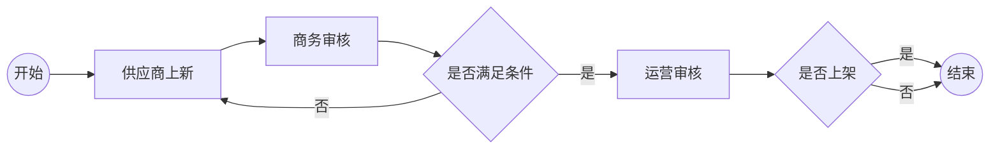
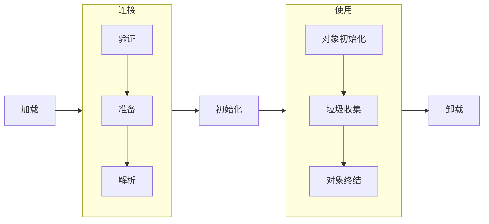
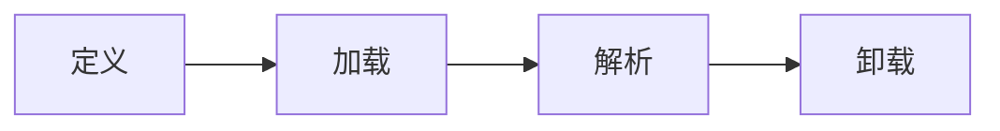
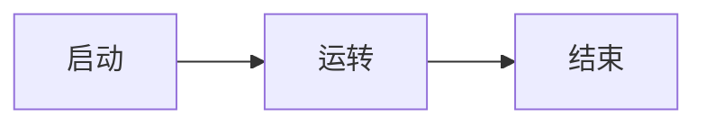
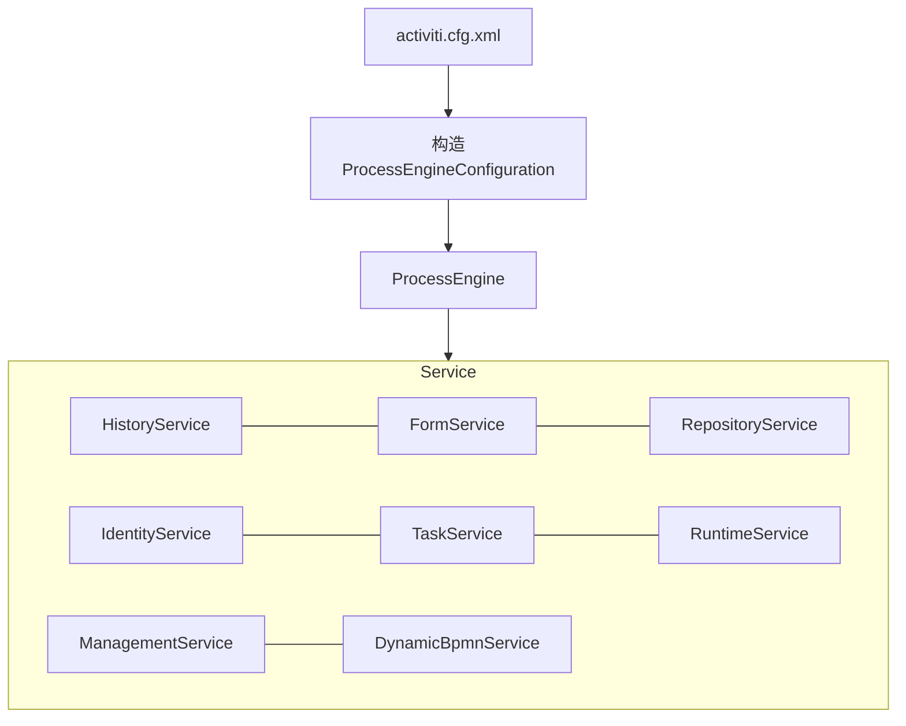
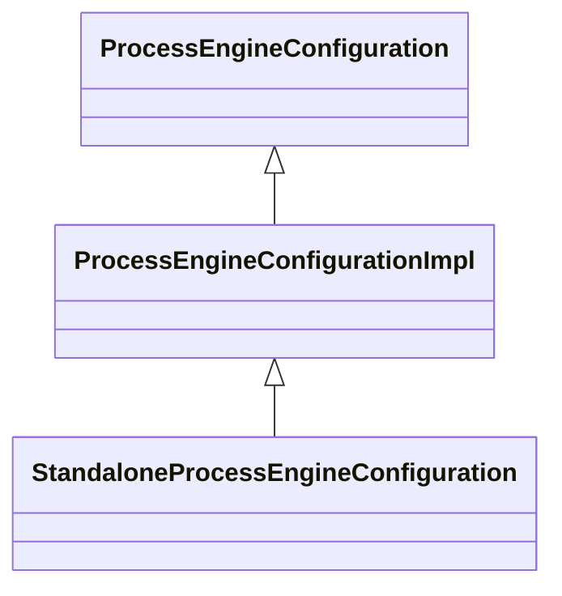

# Activiti


## 工作流

### 概念

工作流（Workflow），就是“业务过程的部分或整体在计算机应用环境下的自动化”，它主要解决的是“使在多个参与者之间按照某种**预定义的规则**传递文档、信息或任务的过程自动进行，从而实现某个预期的业务目标，或者促使此目标的实现”


### 工作流管理系统

工作流管理系统（Workflow Management System，WfMS），是一个软件系统，它完成**工作流的定义和管理**，并按照系统中预先定义好的工作流规则进行工作流实例的执行。工作流管理系统不是企业的业务系统，而是为企业的业务系统的运行提供了一个软件的支撑环境。

>  工作流管理联盟（Workflow Management Coalition，WfMC）给出的关于工作流管理系统的定义：工作流管理系统是一个软件系统，它通过执行经过计算的**流程定义**去支持一批专门设定的业务流程。工作流管理系统被用来定义、管理和执行工作流程。

工作流管理系统的目标：管理工作的流程以确保工作在正确的时间被期望的人员所执行——在自动化进行的任务过程中插入人工的执行和干预。


### 工作流介绍



- 人物：供应商、商务审核人、运营审核人、负责签订合同的人等
- 事件（动作）：是否通过
- 发起流程和结束流程：只有流程被发起了，后续的每个环节的人才有可能看到自己审核任务并进行处理
- 任务：由不同的环节协作去完成这个流程
- 待办任务：谁需要做什么事情，涉及到两个核心概念：“人”、“任务”

> 流程运转的本质就是数据的流转、数据状态的变更。


### 工作流选型

#### 规范支持

| 框架          | BPMN2.0规范        | CMMN规范           | DMN规范                      |
| ------------- | ------------------ | ------------------ | ---------------------------- |
| Activiti 5.x  | :heavy_check_mark: | :x:                | :x:                          |
| Flowable 5.x  | :heavy_check_mark: | :x:                | :x:                          |
| Activitit 6.x | :heavy_check_mark: | :x:                | :heavy_check_mark:（不稳定） |
| Flowable 6.x  | :heavy_check_mark: | :heavy_check_mark: | :heavy_check_mark:           |

#### 特性

| 框架          | PVM（流程虚拟机）  | Job                | AsyncExecutor      | 瞬态变量           | 事务依赖监听器     | 历史数据表单单独处理 |
| ------------- | ------------------ | ------------------ | ------------------ | ------------------ | ------------------ | -------------------- |
| Activiti 5.x  | :heavy_check_mark: | :heavy_check_mark: | :heavy_check_mark: | :x:                | :x:                | :x:                  |
| Flowable 5.x  | :heavy_check_mark: | :heavy_check_mark: | :heavy_check_mark: | :x:                | :x:                | :x:                  |
| Activitit 6.x | :x:                | :x:                | :heavy_check_mark: | :heavy_check_mark: | :heavy_check_mark: | :heavy_check_mark:   |
| Flowable 6.x  | :x:                | :x:                | :heavy_check_mark: | :heavy_check_mark: | :heavy_check_mark: | :heavy_check_mark:   |

| 框架          | Agenda             | AtomicOperation    | xxoperation        | 消息               | LiquiBase          | 多实例加/减签      |
| ------------- | ------------------ | ------------------ | ------------------ | ------------------ | ------------------ | ------------------ |
| Activiti 5.x  | :x:                | :heavy_check_mark: | :heavy_check_mark: | :x:                | :x:                | :x:                |
| Flowable 5.x  | :x:                | :heavy_check_mark: | :heavy_check_mark: | :x:                | :x:                | :x:                |
| Activitit 6.x | :heavy_check_mark: | :x:                | :heavy_check_mark: | :heavy_check_mark: | :heavy_check_mark: | :x:                |
| Flowable 6.x  | :heavy_check_mark: | :x:                | :heavy_check_mark: | :heavy_check_mark: | :heavy_check_mark: | :heavy_check_mark: |


### Java类的生命周期




### 工作流的生命周期 

#### 流程定义的生命周期



#### 流程实例的生命周期




## Activiti 6.0.0 Release的使用

> 程序包：https://github.com/Activiti/Activiti/releases/download/activiti-6.0.0/activiti-6.0.0.zip

### 目录结构

- `database/create/*`：数据表视图、索引创建脚本。形如：activiti.db2.create.engine.sql，其中db2代表操作的数据库类型
- `database/drop/*`：数据表视图、索引删除脚本。形如：activiti.db2.drop.engine.sql
- `database/upgrade/*`：数据表视图、索引更新脚本。形如：activiti.db2.upgradestep.53.to.54.engine.sql，其中“53”对应引擎版本（5.13），“54”对应引擎版本（5.14）
- `libs/*`：activiti依赖jar包
- `wars/activiti-admin.war`：管控监控流程
- `wars/activiti-app.war`
- `wars/activiti-rest.war`：暴露接口以供外部访问
- `notice.txt`：第三方依赖包说明
- `readme.html`：版本更新说明


### 源码下载与编译

下载方式1：

```sh
# 克隆指定分支
git clone --branch activiti-6.0.0 git@github.com:Activiti/Activiti.git
```

下载方式2：

```shell
# 克隆主分支
git clone git@github.com:Activiti/Activiti.git
# 查看远程分支
git branch -a
# 切换到指定分支
git checkout activiti-6.0.0
```

编译源码

```shell
# /d/DevEnv/apache-maven-3.6.3/conf/settings.xml 是本机maven的settings.xml文件
mvn compile -Dmavem.test.ship=true -s /d/DevEnv/apache-maven-3.6.3/conf/settings.xml
```

源码目录结构

- `distro/*`：打包好的文件
- `eclipse/*`：eclipse模板文件
- `modules/*`：Activiti所有模块的Java源代码文件
- `qa/*`：一些通用的流程配置文件样例
- `script/*`：启动/部署脚本文件
- `pom.xml`：所有Maven工程的parent。Activiti工程依赖的第三方程序包均定义在该文件中。Flowable各个子模块项目中依赖的第三方包均定义在该文件中


### sql脚本类型

engine：主要用于创建核心表，如：`ACT_ru*`表等

history：主要用于创建历史表，如：`ACT_hi*`表等

identity：主要用于创建用户表以及用户消息表（扩展表的时候可以不使用该脚本），如：`ACT_id*`等


### 运行activiti-app

将wars目录下的`activiti-app.war`放在`tomcat/webapps`目录中。

在`tomcat/webapps/activiti-app/WEB-INF/classes/META-INF/activiti-app`目录下，打开`activiti-app.properties`，按需修改配置

```properties
#
# SECURITY
#
security.rememberme.key=testkey

#
# DATABASE
#

datasource.driver=org.h2.Driver
datasource.url=jdbc:h2:mem:activiti;DB_CLOSE_DELAY=-1

#datasource.driver=com.mysql.jdbc.Driver
#datasource.url=jdbc:mysql://127.0.0.1:3306/activiti6ui?characterEncoding=UTF-8

datasource.username=sa
datasource.password=

hibernate.dialect=org.hibernate.dialect.H2Dialect
#hibernate.dialect=org.hibernate.dialect.MySQLDialect
#hibernate.dialect=org.hibernate.dialect.Oracle10gDialect
#hibernate.dialect=org.hibernate.dialect.SQLServerDialect
#hibernate.dialect=org.hibernate.dialect.DB2Dialect
#hibernate.dialect=org.hibernate.dialect.PostgreSQLDialect

# 
# EMAIL
# 

#email.enabled=true
#email.host=localhost
#email.port=1025
#email.useCredentials=false
#email.username=
#email.password=

# The base url that will be used to create urls in emails.
#email.base.url=http://localhost:9999/activiti-app

#email.from.default=no-reply@activiti.alfresco.com
#email.from.default.name=Activiti
#email.feedback.default=activiti@alfresco.com
        
#
# ACTIVITI
#

activiti.process-definitions.cache.max=500

#
# DEFAULT ADMINISTRATOR ACCOUNT
#

admin.email=admin
admin.password=test
admin.lastname=Administrator

admin.group=Superusers

# The maximum file upload limit. Set to -1 to set to 'no limit'. Expressed in bytes
file.upload.max.size=104857600

# For development purposes, data folder is created inside the sources ./data folder
contentstorage.fs.rootFolder=data/
contentstorage.fs.createRoot=true
contentstorage.fs.depth=4
contentstorage.fs.blockSize=1024

```

启动tomcat

```shell
bin ./startup.sh & tail -f ../logs/catalina.out
```

访问：http://localhost:8080/activiti-app，默认用户名：admin，密码：test


#### 数据库表

##### 用户相关表

- ACT_ID_GROUP：分组表
- ACT_ID_USER：用户表
- ACT_ID_MEMBERSHIP：分组-用户关联表
- ACT_IDM_PERSISTENT_TOKEN：用户登录日志表


### 运行activiti-admin

将wars目录下的`activiti-admin.war`放在`tomcat/webapps`目录中。

在`tomcat/webapps/activiti-admin/WEB-INF/classes/META-INF/activiti-admin`目录下，打开`activiti-admin.properties`，按需修改配置

```properties
# security configuration (this key should be unique for your application, and kept secret)
security.rememberme.key=activitis3cr3tk3y


# H2 example (default)

#datasource.driver=org.h2.Driver
#datasource.url=jdbc:h2:tcp://localhost/activitiadmin

# MySQL example

#datasource.driver=com.mysql.jdbc.Driver
#datasource.url=jdbc:mysql://127.0.0.1:3306/activitiadmin?characterEncoding=UTF-8

#datasource.driver=org.postgresql.Driver
#datasource.url=jdbc:postgresql://localhost:5432/activitiadmin

#datasource.driver=com.microsoft.sqlserver.jdbc.SQLServerDriver
#datasource.url=jdbc:sqlserver://localhost:1433;databaseName=activitiadmin

#datasource.driver=oracle.jdbc.driver.OracleDriver
#datasource.url=jdbc:oracle:thin:@localhost:1521:ACTIVITIADMIN

#datasource.driver=com.ibm.db2.jcc.DB2Driver
#datasource.url=jdbc:db2://localhost:50000/activitiadmin

#datasource.username=activiti
#datasource.password=

# JNDI CONFIG

# If uncommented, the datasource will be looked up using the configured JNDI name.
# This will have preference over any datasource configuration done below that doesn't use JNDI
#
# Eg for JBoss: java:jboss/datasources/activitiDS
#
#datasource.jndi.name=jdbc/activitiDS

# Set whether the lookup occurs in a J2EE container, i.e. if the prefix "java:comp/env/" needs to be added if the JNDI
# name doesn't already contain it. Default is "true".
#datasource.jndi.resourceRef=true

#hibernate.dialect=org.hibernate.dialect.H2Dialect
#hibernate.dialect=org.hibernate.dialect.MySQLDialect
#hibernate.dialect=org.hibernate.dialect.Oracle10gDialect
#hibernate.dialect=org.hibernate.dialect.SQLServerDialect
#hibernate.dialect=org.hibernate.dialect.DB2Dialect
#hibernate.dialect=org.hibernate.dialect.PostgreSQLDialect
#hibernate.show_sql=false
#hibernate.generate_statistics=false

#
# Connection pool (see http://www.mchange.com/projects/c3p0/#configuration)
#

#datasource.min-pool-size=5
#datasource.max-pool-size=100
#datasource.acquire-increment=5
# test query for H2, MySQL, PostgreSQL and Microsoft SQL Server
#datasource.preferred-test-query=select 1
# test query for Oracle
#datasource.preferred-test-query=SELECT 1 FROM DUAL
# test query for DB2
#datasource.preferred-test-query=SELECT current date FROM sysibm.sysdummy1
#datasource.test-connection-on-checkin=true
#datasource.test-connection-on-checkout=true
#datasource.max-idle-time=1800
#datasource.max-idle-time-excess-connections=1800

#
# Cluster settings
#

# This a period of time, expressed in milliseconds, that indicates
# when a node is deemed to be inactive and is removed from the list
# of nodes of a cluster (nor will it appear in the 'monitoring' section of the application).
#
# When a node is properly shut down, it will send out an event indicating
# it is shut down. From that point on, the data will be kept in memory for the amount
# of time indicated here.
# When a node is not properly shut down (eg hardware failure), this is the period of time
# before removal, since the time the last event is received.
#
# Make sure the value here is higher than the sending interval of the nodes, to avoid
# that nodes incorrectly removed.
#
# By default 10 minutes
cluster.monitoring.max.inactive.time=600000

# A cron expression that configures when the check for inactive nodes is made.
# When executed, this will mark any node that hasn't been active for 'cluster.monitoring.max.inactive.time'
# seconds, as an inactive node. Default: every 5 minutes.
cluster.monitoring.inactive.check.cronexpression=0 0/5 * * * ?

# REST endpoint config
rest.app.name=Activiti app
rest.app.description=Activiti app Rest config
rest.app.host=http://localhost
rest.app.port=9999
rest.app.contextroot=activiti-app
rest.app.restroot=api
rest.app.user=admin
rest.app.password=test

# Passwords for rest endpoints and master configs are stored encrypted in the database using AES/CBC/PKCS5PADDING
# It needs a 128-bit initialization vector (http://en.wikipedia.org/wiki/Initialization_vector)
# and a 128-bit secret key represented as 16 ascii characters below
#
# Do note that if these properties are changed after passwords have been saved, all existing passwords
# will not be able to be decrypted and the password would need to be reset in the UI.
security.encryption.credentialsIVSpec=j8kdO2hejA9lKmm6
security.encryption.credentialsSecretSpec=9FGl73ngxcOoJvmL

# BPMN 2.0 Modeler config

modeler.url=https://activiti.alfresco.com/activiti-app/api/

# Enable multi tenant support, disabled by default
#multi-tenant.enabled=true 
```

启动tomcat

```shell
bin ./startup.sh & tail -f ../logs/catalina.out
```

访问：http://localhost:8080/activiti-admin，默认用户名：admin，密码：admin

校验是否连接到activiti-app


### 运行activiti-rest

将wars目录下的`activiti-rest.war`放在`tomcat/webapps`目录中。

在`tomcat/webapps/activiti-rest/WEB-INF/classes`目录下，打开`db.properties`，按需修改配置

```properties
db=h2
jdbc.driver=org.h2.Driver
jdbc.url=jdbc:h2:mem:activiti;DB_CLOSE_DELAY=-1
jdbc.username=sa
jdbc.password=
```

访问Swagger文档：http://localhost:8080/activiti-rest/docs，默认用户名：kermit，密码：kermit


## 流程引擎

### 相关引擎服务获取流程



- `RepositoryService`：操作流程定义
- `RuntimeService`：操作流程实例
- `TaskService`：操作任务
- `IdentityService`：操作用户或者组

- `HistoryService`：查询历史表数据
- `DynamicBpmnService`：动态`BPMN`服务
- `ManagementService`：执行命令或者定时器
- `FormService`：操作与流程表单相关的服务

### Activiti配置风格获取引擎源码

> 问：默认的流程引擎`ProcessEngine`对象是如何构建的?
>
> 答：通过`ProcessEngines.getDefaultProcessEngine()`

#### `ProcessEngines`

流程引擎管理类：负责流程引擎的初始化、创建、注册、注销、销毁、获取等操作

##### 主要属性

```java
// 是否已经初始化
protected static boolean isInitialized;

// key 流程引擎名称
// value 流程引擎实例对象
Map<String, ProcessEngine> processEngines = new HashMap<String, ProcessEngine>();

// key 流程引擎名称 
// value 流程引擎信息类实例对象
Map<String, ProcessEngineInfo> processEngineInfosByName = new HashMap<String, ProcessEngineInfo>();

// key 构造流程引擎的资源名称
// value 流程引擎信息类
Map<String, ProcessEngineInfo> processEngineInfosByResourceUrl = new HashMap<String, ProcessEngineInfo>();

// 存储流程引擎信息类实例对象
List<ProcessEngineInfo> processEngineInfos = new ArrayList<ProcessEngineInfo>();
```

##### 主要方法

```java
// 获取默认流程引擎
public static ProcessEngine getDefaultProcessEngine();

// 获取所有在classpath上的activiti.cfg.xml遍历初始化流程引擎
// 获取所有在classpath上的activiti.xml(Spring风格配置)遍历初始化所有流程引擎
public synchronized static void init();

// 根据activiti.cfg.xml初始化流程引擎：构造引擎并将引擎信息缓存
private static ProcessEngineInfo initProcessEngineFromResource(URL resourceUrl);

// 构造引擎的核心方法
private static ProcessEngine buildProcessEngine(URL resource) {
    // ...
      
    // 读取文件流
    inputStream = resource.openStream();
    // 根据activiti.cfg.xml创建ProcessEngineConfiguration(流程引擎配置对象)
    ProcessEngineConfiguration processEngineConfiguration = ProcessEngineConfiguration.createProcessEngineConfigurationFromInputStream(inputStream);
    // 通过ProcessEngineConfiguration构建流程引擎
    return processEngineConfiguration.buildProcessEngine();
	
    // ...
}
```

> 接下来，看看`ProcessEngineConfiguration`又是如何创建流程引擎配置对象（ProcessEngineConfiguration）和构建流程流程引擎（ProcessEngine）。
>
> 要知道创建流程引擎配置对象首先看`ProcessEngineConfiguration`类，其次看`StandaloneProcessEngineConfiguration`如何初始化。

#### `ProcessEngineConfiguration`

##### 相关配置

###### `activiti.cfg.xml`

```xml
<bean id="processEngineConfiguration" class="org.activiti.engine.impl.cfg.StandaloneProcessEngineConfiguration">
    <!--代表数据源-->
    <property name="dataSource" ref="dataSource"/>
    <!--代表是否生成表结构-->
    <property name="databaseSchemaUpdate" value="true"/>
</bean>
```

##### 主要方法

```java
// 这里有个写死的beanName为"processEnginConfiguration",与定义的activiti.cfg.xml定义的id为"processEngineConfiguration"的bean相对应
// 也就是说构建出来的ProcessEngineConfiguration是通过activiti.cfg.xml定义的
public static ProcessEngineConfiguration createProcessEngineConfigurationFromInputStream(InputStream inputStream) {
    return createProcessEngineConfigurationFromInputStream(inputStream, "processEngineConfiguration");
}

// 调用BeansConfigurationHelper#parseProcessEngineConfigurationFromInputStream
public static ProcessEngineConfiguration createProcessEngineConfigurationFromInputStream(InputStream inputStream, String beanName) {
    /*
    	调用BeansConfigurationHelper#parseProcessEngineConfigurationFromInputStream做的事情主要有以下：
    		1. 将inputStream包装成为Spring的Resource对象
    		2. 根据activiti.cfg.xml中bean的定义加载bean到beanFactory
    		3. 根据beanName(也就是processEngineConfiguration)获取到对应的bean(也就是在activiti.cfg.xml定义的processEngineConfiguration)
    		4. 因此，最后获取到的bean是org.activiti.engine.impl.cfg.StandaloneProcessEngineConfiguration的实例
    */
    return BeansConfigurationHelper.parseProcessEngineConfigurationFromInputStream(inputStream, beanName);
}
```

> 接下来看看`StandaloneProcessEngineConfiguration`的实例化

#### `StandaloneProcessEngineConfiguration`

##### 继承关系




```java
public class StandaloneProcessEngineConfiguration extends ProcessEngineConfigurationImpl {
    
    @Override
    public CommandInterceptor createTransactionInterceptor() {
        return null;
    }
}

public abstract class ProcessEngineConfigurationImpl extends ProcessEngineConfiguration {
    ...
    
    // SERVICES /////////////////////////////////////////////////////////////////
    
    protected RepositoryService repositoryService = new RepositoryServiceImpl();
    protected RuntimeService runtimeService = new RuntimeServiceImpl();
    protected HistoryService historyService = new HistoryServiceImpl(this);
    protected IdentityService identityService = new IdentityServiceImpl();
    protected TaskService taskService = new TaskServiceImpl(this);
    protected FormService formService = new FormServiceImpl();
    protected ManagementService managementService = new ManagementServiceImpl();
    protected DynamicBpmnService dynamicBpmnService = new DynamicBpmnServiceImpl(this);
    
    // FORM ENGINE SERVICES /////////////////////////////////////////////////////
    
    // COMMAND EXECUTORS ////////////////////////////////////////////////////////
    
    // DATA MANAGERS /////////////////////////////////////////////////////////////
    
    // ENTITY MANAGERS ///////////////////////////////////////////////////////////
    
    // History Manager 
    
    // Job Manager
    
    // SESSION FACTORIES /////////////////////////////////////////////////////////
    
    // CONFIGURATORS ////////////////////////////////////////////////////////////
    
    // DEPLOYERS //////////////////////////////////////////////////////////////////
    
    // JOB EXECUTOR /////////////////////////////////////////////////////////////
    
    // HELPERS //////////////////////////////////////////////////////////////////
    
    // ASYNC EXECUTOR ///////////////////////////////////////////////////////////
    
    // MYBATIS SQL SESSION FACTORY //////////////////////////////////////////////
    
    // ID GENERATOR ///////////////////////////////////////////////////////////////
   	
    // BPMN PARSER //////////////////////////////////////////////////////////////
    
    // PROCESS VALIDATION //////////////////////////////////////////////////////////////
    
    // OTHER //////////////////////////////////////////////////////////////////////
    
    ...
}
```

实际上`StandaloneProcessEngineConfiguration`的代码并不多，只是提供了一个标准的实现方式作为门面。

由此可看出，`ProcessEngineConfigurationImpl`提供了一系列默认的流程引擎配置信息、流程服务、表单引擎服务、命令执行器、数据管理类、实体管理类等的初始化工作。而

> 最后，调用初始化完成的`ProcessEngineConfigurationImpl`的对象的`buildProcessEngine`方法构建`ProcessEngnie`

#### `ProcessEngineConfigurationImpl`

