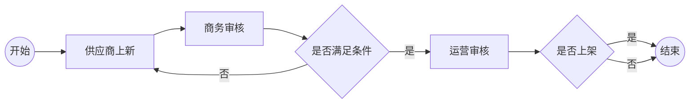

# Activiti


## 工作流

### 概念

工作流（Workflow），就是“业务过程的部分或整体在计算机应用环境下的自动化”，它主要解决的是“使在多个参与者之间按照某种**预定义的规则**传递文档、信息或任务的过程自动进行，从而实现某个预期的业务目标，或者促使此目标的实现”


### 工作流管理系统

工作流管理系统（Workflow Management System，WfMS），是一个软件系统，它完成**工作流的定义和管理**，并按照系统中预先定义好的工作流规则进行工作流实例的执行。工作流管理系统不是企业的业务系统，而是为企业的业务系统的运行提供了一个软件的支撑环境。

>  工作流管理联盟（Workflow Management Coalition，WfMC）给出的关于工作流管理系统的定义：工作流管理系统是一个软件系统，它通过执行经过计算的**流程定义**去支持一批专门设定的业务流程。工作流管理系统被用来定义、管理和执行工作流程。

工作流管理系统的目标：管理工作的流程以确保工作在正确的时间被期望的人员所执行——在自动化进行的任务过程中插入人工的执行和干预。


### 工作流介绍



- 人物：供应商、商务审核人、运营审核人、负责签订合同的人等
- 事件（动作）：是否通过
- 发起流程和结束流程：只有流程被发起了，后续的每个环节的人才有可能看到自己审核任务并进行处理


### 工作流选型

#### 规范支持

| 框架          | BPMN2.0规范        | CMMN规范           | DMN规范                      |
| ------------- | ------------------ | ------------------ | ---------------------------- |
| Activiti 5.x  | :heavy_check_mark: | :x:                | :x:                          |
| Flowable 5.x  | :heavy_check_mark: | :x:                | :x:                          |
| Activitit 6.x | :heavy_check_mark: | :x:                | :heavy_check_mark:（不稳定） |
| Flowable 6.x  | :heavy_check_mark: | :heavy_check_mark: | :heavy_check_mark:           |

#### 特性

| 框架          | PVM（流程虚拟机）  | Job                | AsyncExecutor      | 瞬态变量           | 事务依赖监听器     | 历史数据表单单独处理 |
| ------------- | ------------------ | ------------------ | ------------------ | ------------------ | ------------------ | -------------------- |
| Activiti 5.x  | :heavy_check_mark: | :heavy_check_mark: | :heavy_check_mark: | :x:                | :x:                | :x:                  |
| Flowable 5.x  | :heavy_check_mark: | :heavy_check_mark: | :heavy_check_mark: | :x:                | :x:                | :x:                  |
| Activitit 6.x | :x:                | :x:                | :heavy_check_mark: | :heavy_check_mark: | :heavy_check_mark: | :heavy_check_mark:   |
| Flowable 6.x  | :x:                | :x:                | :heavy_check_mark: | :heavy_check_mark: | :heavy_check_mark: | :heavy_check_mark:   |

| 框架          | Agenda             | AtomicOperation    | xxoperation        | 消息               | LiquiBase          | 多实例加/减签      |
| ------------- | ------------------ | ------------------ | ------------------ | ------------------ | ------------------ | ------------------ |
| Activiti 5.x  | :x:                | :heavy_check_mark: | :heavy_check_mark: | :x:                | :x:                | :x:                |
| Flowable 5.x  | :x:                | :heavy_check_mark: | :heavy_check_mark: | :x:                | :x:                | :x:                |
| Activitit 6.x | :heavy_check_mark: | :x:                | :heavy_check_mark: | :heavy_check_mark: | :heavy_check_mark: | :x:                |
| Flowable 6.x  | :heavy_check_mark: | :x:                | :heavy_check_mark: | :heavy_check_mark: | :heavy_check_mark: | :heavy_check_mark: |


## Activiti 6.0.0 Release的使用

> 程序包：https://github.com/Activiti/Activiti/releases/download/activiti-6.0.0/activiti-6.0.0.zip

### 目录结构

- `database/create/*`：数据表视图、索引创建脚本。形如：activiti.db2.create.engine.sql，其中db2代表操作的数据库类型
- `database/drop/*`：数据表视图、索引删除脚本。形如：activiti.db2.drop.engine.sql
- `database/upgrade/*`：数据表视图、索引更新脚本。形如：activiti.db2.upgradestep.53.to.54.engine.sql，其中“53”对应引擎版本（5.13），“54”对应引擎版本（5.14）
- `libs/*`：activiti依赖jar包
- `wars/activiti-admin.war`：管控监控流程
- `wars/activiti-app.war`
- `wars/activiti-rest.wat`：暴露接口以供外部访问
- `notice.txt`：第三方依赖包说明
- `readme.html`：版本更新说明


### 源码下载与编译

下载方式1：

```sh
# 克隆指定分支
git clone --branch activiti-6.0.0 git@github.com:Activiti/Activiti.git
```

下载方式2：

```shell
# 克隆主分支
git clone git@github.com:Activiti/Activiti.git
# 查看远程分支
git branch -a
# 切换到指定分支
git checkout activiti-6.0.0
```

编译源码

```shell
# /d/DevEnv/apache-maven-3.6.3/conf/settings.xml 是本机maven的settings.xml文件
mvn compile -Dmavem.test.ship=true -s /d/DevEnv/apache-maven-3.6.3/conf/settings.xml
```

源码目录结构

- `distro/*`：打包好的文件
- `eclipse/*`：eclipse模板文件
- `modules/*`：Activiti所有模块的Java源代码文件
- `qa/*`：一些通用的流程配置文件样例
- `script/*`：启动/部署脚本文件
- `pom.xml`：所有Maven工程的parent。Activiti工程依赖的第三方程序包均定义在该文件中。Flowable各个子模块项目中依赖的第三方包均定义在该文件中


### sql脚本类型

engine：主要用于创建核心表，如：`ACT_ru*`表等

history：主要用于创建历史表，如：`ACT_hi*`表等

identity：主要用于创建用户表以及用户消息表（扩展表的时候可以不使用该脚本），如：`ACT_id*`等


## Activiti生命周期

### 流程定义


### 流程实例


