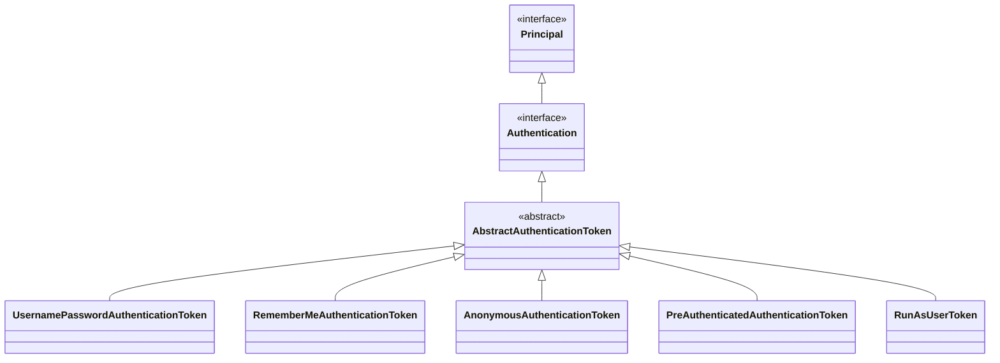

# Spring Security + OAuth2


## 认证和授权

### 认证（Authentication） 


### 授权（Authorization）


### Spring Filters

任何Spring Web应用本质上只是一个Servlet，Security Filter在HTTP请求到达你的Controller之前过滤每个传入的HTTP请求


#### 过滤器示例

```java
// (伪代码)
public class SecurityServletFilter extends HttpFilter {

    @Override
    protected void doFilter(HttpServletRequest request, HttpServletResponse response, FilterChain chain) throws IOException, ServletException {
        UsernamePasswordToken token = extractUsernameAndPasswordForm(request);	// (1)
        
        if (notAuthenticated(token)) {	// (2)
            // 用户名或密码错误
            // HTTP 401 认证失败
            response.setStatus(HttpServletResponse.SC_UNAUTHORIZED);
            return;
        }
        
        if (notAuthorized(token, request)) {	// (3)
            // HTTP 403 认证了但没有对应的授权
            response.setStatus(HttpServletResponse.SC_FORBIDDEN);
            return;
        }
        
        // 将HttpRequest,HttpResponse发给DispatherServlet
        chain.doFilter(request, response);	// (4)
    }

    private UsernamePasswordAuthenticationToken extractUsernameAndPasswordForm(HttpServletRequest request) {
		/*
        checkUsernameAndPassword方法暂未实现
        用户名和密码的方式：
        	1. 从Basic Auth HTTP头中获取
        	2. 从登录表单提交后的HTTP请求参数或POST的body中获取
        */
        return checkUsernameAndPassword(request);
    }
    
    private boolean notAuthenticated(UsernamePasswordToken token) {
        // 与数据库、LDAP等数据源校验用户名密码
        return false;
    }
    
    private boolean notAuthorized(UsernamePasswordToken token, HttpServletRequest request) {
        // 校验当前用户是否拥有对应的权限
        return false;
    }
    
}
```

1. 过滤器从请求中获取用户名、密码。通过一个基本的HTTP头，或者表单数据，获取cookie等
2. 过滤器对用户名、密码组合进行验证，如：数据库
3. 验证成功后，过滤器需要检查用户是否被授权访问请求的URI
4. 如果请求通过了所有这些检查，那么过滤器就可以让请求通过`DispacherServlet`后重定向到Controller


### Spring Security

#### Filter Chain

`Spring Security`不会把所有校验逻辑写在一起，而是才分成一个一个的过滤器，通过过滤链实现认证和授权


##### 常见的内置过滤器

- `BasicAuthenticationFilter`：在请求中找一个Basic Auth Http头，如果找到了，则尝试用该头中的用户名和密码验证用户
- `UsernamePasswordAuthenticationFilter`：在请求参数中或者POST body中找到用户名和密码，如果找到了，则尝试用这些值对用户进行身份验证
- `DefaultLoginPageGeneratingFilter`：默认登录页面生成过滤器。用于生成一个登录页面，如果没有禁止这个功能，那么就会生成一个登录页面。这就是为什么启动Spring Security时，会得到一个默认登录页面
- `DefaultLogoutPageGeneratingFilter`：默认注销页面生成过滤器。用于生成一个注销页面，如果没有禁止这个功能，那么就会生成一个注销页面。
- `FilterSecurityInterceptor`：过滤安全拦截器，用于授权逻辑


#### 配置Spring Security

Spring Security通过继承`WebSecurityConfigurationAdapter`这个类，可以选择实现该类中的三个重载的configure方法

```java
@EnableWebSecurity
public class SecurityConfig extends WebSecurityConfigurerAdapter {
    
    @Override
    protected void configure(AuthenticationManagerBuilder auth) throws Exception {
        super.configure(auth);
    }

	@Override
    protected void configure(HttpSecurity http) throws Exception {
        super.configure(http);
    }

    @Override
    public void configure(WebSecurity web) throws Exception {
        super.configure(web);
    }

}
```

- `configure(AuthenticationManagerBuilder)`：用于通过允许`AuthenticationProvider`容易地添加来建立认证机制。也就是说用来记录账号，密码，角色信息。
- `configure(HttpSecurity)`：允许基于选择匹配在资源级配置基于网络的安全性。也就是对角色的权限——所能访问的路径做出限制。
- `configure(WebSecurity)`：用于影响全局安全性(配置资源，设置调试模式，通过实现自定义防火墙定义拒绝请求)的配置设置。一般用于配置全局的某些通用事物，例如静态资源等

参考：[Spring Security的三个configure方法](https://www.cnblogs.com/woyujiezhen/p/13049979.html)


## Spring Security

### 核心组件


#### SecurityContextHolder

`SecurityContextHolder`是一个工具类，它提供了对安全上下文（`SecurityContext`）的访问。默认情况下，它使用一个ThreadLocal对象来存储安全上下文，这意味着它是线程安全的。

#### SecurityContext

`SecurityContext`用于存储当前认证用户的详细信息

#### Authentication

`Authentication`存储了当前用户（与应用程序交互的主体）的详细信息。其中：

- `Principal`：可以理解为用户的信息
- `Credentials`：可以理解为密码
- `Authorities`：可以理解为权限

`Authentication`是Spring认证体系的核心元素，Spring Security内建了很多具体的子类，比如：`UsernamePasswordAuthenticationToken`（用户名/密码登录场景）



#### UserDetails和UserDetailsService

`UserDetails`定义了通常的场景下用户具备的一系列属性约束，`UserDetailsService`定义了从数据存储中根据用户名找到用户的方法。这两个对象不负责认证工作，只是提供数据。一般通过扩展他们来实现自定义的数据库结构。

```java
public interface UserDetails extends Serializable {

	Collection<? extends GrantedAuthority> getAuthorities();

	String getPassword();

	String getUsername();

	boolean isAccountNonExpired();

	boolean isAccountNonLocked();

	boolean isCredentialsNonExpired();

	boolean isEnabled();
}
```

```java
public interface UserDetailsService {

	UserDetails loadUserByUsername(String username) throws UsernameNotFoundException;
    
}
```


### 认证解析过程


#### AuthenticationManager

- 负责处理身份验证，他的构造函数会要求传入所有的`AuthenticationProviders`
- 内建的AuthenticationManager叫做`ProviderManager`

#### AuthenticationProvider

- 对于不同的认证机制，会有不同的Provider，比如：`DaoAuthenticationProvider`支持基于用户名/密码的认证


