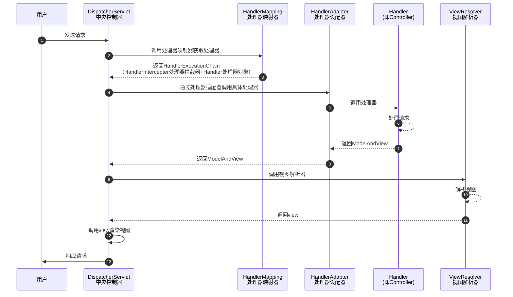

# Java面试题


## Spring

### Spring MVC

#### Spring MVC的工作流程

Spring MVC处理模型数据的方式：

- 将方法返回值设置为`ModelAndView`

```java
@RequestMapping("/test")
public ModelAndView testModelAndView() {
    // 创建ModelAndView对象
    ModelAndView mav = new ModelAndView();
    // 设置模型数据，最终会放到request域中
    mav.putObject("user", "jho");
    // 设置视图
    mav.setViewName("success");
    return mav;
}
```

- 将方法返回值设置为`String`，在方法的入参种传入`Map`、`Model`、`ModelMap`。

```java
@RequestMapping("/test")
public String testMap(Map<String, Object> map) {
    // 向map中添加模型数据，最终会自动放到request域中
	map.put("user", new Employee(1, "jho", new Dept(1, "开发部")));
    return SUCCESS;
}
```

不管将处理器**方法的返回值**设置为`ModelAndView`还是在**方法的入参**中传入`Map`、`Model`、`ModelMap`，Spring MVC都会转换为一个`ModelAndView`对象。

Spring MVC的运行流程




## MyBatis