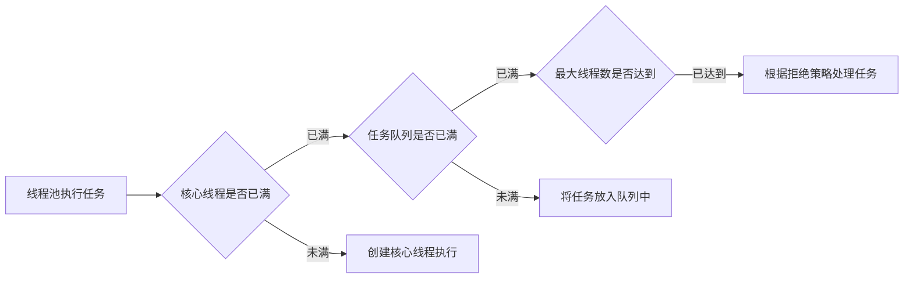
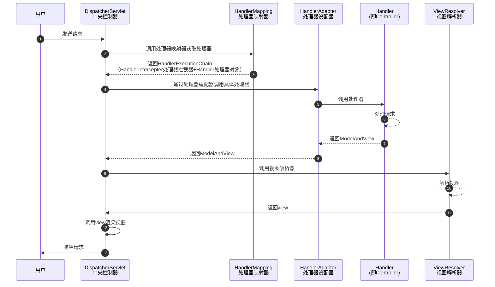

# Java面试题


## Java基础

### final

**修饰类**：表示类不可以被继承

**修饰方法**：表示方法不可被子类覆盖，但是可以重载

**修饰成员变量**：表示变量一旦被赋值就不可以更改它的值

- 如果`final`修饰的是（静态）类变量，只能在**静态代码块**中指定初始值或者声明该类变量时指定初始值
- 如果`final`修饰的是成员变量，可以在**非静态代码块**声明该变量或者在构造器中初始化值

**修饰局部变量**：使用`final`修饰局部变量时，可以在定义时指定默认值（后面的代码不能对变量再赋值）。或者声明时不指定默认值，而在后面的代码中对该变量进行赋值（仅一次）

```java
public class FinalVal {
    
    // 在声明的时候赋值，或者在静态代码块中赋值
    final static int a = 0;
    final static int b;
    
    static {
        b = 0;
    }
    
    public static void main(String[] args) {
        // 局部变量只声明没有初始化，不会报错，但是在使用前一定要赋值，且不允许第二次赋值
		final int localA;
		localA = 0;
    }
    
}
```

**修饰基本类型数据**：被修饰的基本类型变量一旦初始化之后便不能修改。

**修饰引用类型的变量**：被修饰的引用类型变量一旦初始化之后并不能在指定其他内存地址的对象，但对象的值是可变的。

```java
public class FinalReferenceTest {
	public static void main(String[] args) {
    	final int[] arr = {1, 2, 3};
        // 合法
        arr[2] = -3;
        // 非法，不能将arr变量指向到其他内存地址的对象
        arr = {5, 6, 7};
        
        final Person p = new Person(18);
        // 合法
        p.setAge(19);
		// 非法
        p = null;
    }
}
```

#### 为什么局部内部类和匿名内部类只能访问局部final变量

```java
public class Test {
    
    public void method(final int b) {
    	
        final int a = 10;
        
        // 匿名内部类
        new Thread() {
            public void run() {
                System.out.println(a);
                System.out.println(b);
            }
        }.start();
    }
    
}
```

以上编译之后，会生成两个class文件：`Test.class`、`Test1.class`，而`Test1.class`就是对应的匿名内部类编译而成的

- 内部类和外部类是处于同一级别的，内部类不会因为定义在方法中就会随着方法的执行完毕就被销毁。当外部类方法结束时，局部变量就会被销毁，但是内部类对象可能还会存在（当没有人再引用它时才会死亡）。
- 为了保证内部类对象在外部类对象的方法销毁时，能够继续使用外部类对象方法的局部变量，会将外部类对象方法局部变量赋值一份作为内部类的成员变量。
- 为了保证复制进内部类的变量和外部类的局部变量保持一样，则将外部类的局部变量修饰成为`final`，以此来保证内部类的成员变量和方法的局部变量的一致性。


### hashCode和equals的区别

- 如果两个对象相等，则hashcode一定相同
- 如果两个对象相等，对两个对象分别调用`equals()`都返回`true`
- 如果两个对象有相同的hashcode，它们也不一定相等
- 被`equals()`方法覆盖过，则`hashCode()`方法也必须被覆盖（[面试官：重写 equals 时为什么一定要重写 hashCode？](https://cloud.tencent.com/developer/article/1910930)）
- `hashCode()`方法默认行为是对堆上的对象产生独特值。如果没有重写`hashCode()`方法，则该class的两个对象无论如何都不会相等。


### 接口和抽象类的区别

**定义层面**

- 抽象类是对类本质的抽象，表达的是`is a`的关系，比如：`BMW is a Car`。抽象类包含并实现了子类的通用特性，将子类存在差异化的特性进行抽象，交由子类实现。
- 接口是对行为的抽象，表达的是`like a`的关系，比如：`Bird like a Aircraft`，但其本质上`is a Bird`。接口的核心是定义行为，即实现类可以做什么，至于实现主题是谁，如何实现，接口并不需要关心。

**语法层面**

- 抽象类可以存在普通成员函数，而接口中只能存在`public abstract`方法和默认方法
- 抽象类中的成员变量可以是各种类型的，而接口中的成员变量只能是`public static final`类型的
- 只能继承一个抽象类，可以实现多个接口

**设计层面**

- 接口的设计目的是对类的行为进行约束，提供一种机制强制要求不同的类具有相同的行为，它约束了行为的有无，但不对其实现进行限制。
- 抽象类的设计目的是代码复用。

**使用场景**

- 当关注一个事物的本质的时候，用抽象类
- 当关注一个操作的时候，用接口


### 集合

#### List和Set的区别

- `List`：有序，按对象进入的顺序保存对象，可重复，允许多个`null`，可以用`Iterator`取出所有元素，再逐一遍历，也可以使用`get(index)`获取指定下标元素
- `Set`：无序，不可重复，最多允许有一个`null`，只能用`Iterator`取出所有元素，再逐一遍历

#### ArrayList和LinkedList的区别

**ArrayList**

- 基于数组，连续内存存储，适合下标访问（随机访问）
- 扩容机制：因为数组长度固定，超过长度存数据时需要新建数组，如果不是在尾部插入数据还会涉及到元素的移动
- 使用尾插法并指定适当的初始化容量可以极大提升性能，甚至超过`LinkedList`（需要创建大量的node对象）

**LinkedList**

- 基于链表，可以存储在分散的内存中，适合做数据插入及删除操作，不适合查询（需要逐一遍历）
- 使用`LinkedList`必须使用`Iterotor`，不适用for循环，因为每次for循环体内通过`get(i)`取得某个元素时都需要对list重写遍历，性能消耗很大
- 不适用`indexOf`等返回元素索引，使用`indexOf`对list进行遍历，当结果为空时会遍历整个列表。

#### HashMap和HashTable的区别

**区别**

- `HashMap`方法没有使用`synchronized`修饰，线程非安全。`HashTable`线程安全。
- `HashMap`允许key和value为null，而`HashTable`不允许

**底层实现**

在`JDK8`中，当链表高度达到8，数组长度超过64，链表转变为红黑树，元素以内部类`Node`节点存在

- 计算key的hash值，二次hash然后对数组长度取模，对应到数组下标
- 如果没有产生hash冲突（下标位置没有元素），则直接创建Node存入数组
- 吐过产生hash冲突，先用`equals`比较，相同则取代该元素，不同则判断链表高度插入链表，链表高度达到8且数组长度到64则转变为红黑树，长度低于6则将红黑树转回链表
- key为null，存在下标0的位置


## JVM

### JDK、JRE、JVM三者的关系和联系

JDK：Java开发工具（Java Development Kit）

JRE：Java运行时环境（Java Runtime Environment）

JVM：Java虚拟机（Java Virtual Machine）


### 类加载器

#### 类加载器的分类

[类加载器分类](https://jho-yf.github.io/#/java/jvm?id=类加载器分类)

#### 双亲委派机制

[双亲委派机制](https://jho-yf.github.io/#/java/jvm?id=双亲委派机制)


### JMM

#### 什么是JMM

了解一下[线程三大特性](#线程的三大特性)

JMM（Java内存模型Java Memery Model）本身一种抽象的概念**并不真实存在**，它描述的是一组规则或者规范，通过这组规范**定义了程序中各个变量的访问方式**。 **JMM就是围绕着并发过程中如何处理原子性、可见性和有序性这三个特征来定义的。**[来自：从线程三大特性深入理解JMM（Java 内存模型）](https://zhuanlan.zhihu.com/p/416172908)


JMM关于同步的规定：

- 线程解锁前，必须把共享变量的值刷新回主内存
- 线程加锁前，必须读取主内存的最新值到自己工作内存
- 加锁解锁是同一把锁


由于JVM运行程序的主体是内存，而**每个线程**创建时JVM都会为其创建一个**工作内存（或称栈空间）**，工作内存时每个线程的私有数据区域，而Java内存模型中规定所有变量都存储在主内存。主内存是共享内存区域，所有线程都可以访问，但线程对变量的操作（读写）必须在工作内存中进行，不能直接操作主内存的变量。首先要将变量从主内存拷贝到自己的工作内存，工作内存中此时持有**变量副本**，然后对**变量副本**进行操作，操作完成后再将变量写回主内存。各个进程之间无法访问对方的工作内存，线程间的通信（传值）必须通过主内存来完成。


### GC

#### GC如何判断对象可以被回收

**引用计数法：**每个对象都有一个引用技术属性，新增一个引用时计数加1，引用释放时计数减1，计数为0时对象可以回收。（Python）

> 引用计数法，可能会出现A引用了B，B又引用了B，这时候就算他们不再使用了，但因为相互引用，计数器=1，永远不会被回收

**可达性分析法：**从`GC Roots`开始向下搜索，收缩所走过的路径称为引用链。当一个对象到`GC Roots`没有任何引用链相连时，则证明此对象是不可用的，那么虚拟机就判断是可回收对象。（Java）

`GC Roots`的对象有：

- 虚拟机栈（栈帧中的本地变量表）中引用的对象
- 方法区中类静态属性引用的对象
- 方法区中常量引用的对象
- 本地方法栈中`JNI`（即一般说的Navtive方法）引用的对象

一个被可达性分析标记为可回收的对象，是有机会进行自救的。前提是：覆写了Object的finalize()方法，且GC还没有执行该对象的finalize()方法。（[Java GC回收算法-判定一个对象是否可以回收](https://zhuanlan.zhihu.com/p/81674719)）

## JUC

### 线程

#### 线程的三大特性

- 可见性：当一个线程修改主内存里的共享变量，可以马上通知其他线程。
- 原子性：数据在被一个线程执行的时候，**其他线程不可以同时再运行此数据**。即某个线程做某个具体业务，需要保证整体的完整，要么同时成功，要么同时失败。
- 有序性：CPU为保证内部处理器单元充分利用，会在单线程结果正确的前提之下，对代码指令进行非顺序执行，即**指令重排**。

##### 有序性

计算机再执行程序时，为了提供性能，编译器和处理器常常会对**指令做重排**，一般分为以下3种：

- 编译器优化的重排
- 指令并行的重排
- 内存系统的重排


单线程环境里面确保程序执行结果和代码顺序执行的结果一致。

处理器再进行重排序时必须要考虑指令之间的**数据依赖性**。

多线程环境中线程交替执行，由于编译器优化重排存在，两个线程中使用的变量能否保证一致性是无法确定的，结果无法预测。


#### 线程的生命周期（线程有几种状态）

线程通常有五种状态：**创建**、**就绪**、**运行**、**阻塞**、**死亡**

**新建状态（New）：**新创建一个线程对象

**就绪状态（Runnable）：**线程对象创建后，其他线程调用了该对象的`start()`方法。该状态的线程位于可运行线程池中，变得可运行，等待获取CPU的使用权

**运行状态（Running）：**就绪状态的线程获取了CPU，执行程序代码

**阻塞状态（Blocked）：**阻塞状态是线程因为某种原因放弃CPU使用权，暂时停止运行。直到线程进入就绪状态，才有机会转到运行状态

**死亡状态（Dead）：**线程执行完了或者因异常退出了`run`方法，该线程结束生命周期。


阻塞的情况又分为三种：

- 等待阻塞：运行的线程执行`wait`方法，改线程会释放占用的所有资源，JVM会把该线程放入“等待池”中。进入这个状态后，是不能自动唤醒的，必须依靠其他线程调用`notify`或`notifyAll`方法才能被唤醒，`wait`是`Object`类的方法。
- 同步阻塞：运行的线程在获取对象的同步锁时，若该同步锁被其他线程占用，则JVM就会把该线程放入“锁池”中。
- 其他阻塞：运行的线程执行`sleep`或`join`方法，或者发出了I/O请求时。JVM会把该线程置为阻塞状态。当`sleep`状态超时、`join`等待线程终止或者超时、或者I/O处理完毕时，线程重新转入就绪状态。`sleep`是`Thread`类的方法。


#### sleep()、wait()、join()、yield()的区别

- `sleep()`：`sleep()`是`Thread`类的静态本地方法，`sleep()`不会释放锁。`sleep()`就是把cpu的执行资格和执行权限释放出去，不再运行此线程，当定时事件结束再取回cpu资源，参与cpu调度。`sleep()`常用于当前线程休眠或轮询暂停操作。

- `wait()`：`wait()`是`Object`类的本地方法，`wait()`会释放锁，且等到其他线程调用`notify()`或`notifyAll()`之后，该线程才会去开始竞争锁。`wait()`方法多用于多线程间的通信。
- `yield()`：`yield()`执行后线程直接进入就绪状态，马上释放cpu的执行权，但保留了cpu的执行资格，所以有可能cpu下次进行线程调度还会让这个线程获取到执行权继续执行。
- `join()`：`join()`执行后线程进入阻塞状态，例如再线程B中调用线程A的`join()`，那线程B会进入阻塞队列，直到线程A结束或者中断线程。


### 线程池

#### 为什么用线程池

- 为什么使用线程池提高线程利用率，降低创建和销毁线程的消耗，从而降低资源消耗
- 任务来了，直接有线程可用可执行，而不用先创建线程再执行，提供响应速度
- 线程是稀缺资源，使用线程池可以统一分配调优监控，提供线程的可管理性

#### 线程池参数

`corePoolSize`：核心线程数。正常情况下，创建工作线程数，这些线程创建后并不会消除，而是一种常驻线程，之后随着线程池的销毁而销毁。

`maxinumPoolSize`：最大线程数，它与核心线程数相对应，表示最大允许被创建的线程数。比如：当前任务较多，将核心线程数都哟弄个为了，还无法满足需求时，此时就会创建新的线程，但线程池内总线程数不会超过`maxinumPoolSize`

`keepAliveTime`、`unit`：超过核心线程数之外的线程的空闲存活时间，也就是核心线程不会消除，但超出核心线程数的部分线程如果空闲一定的时间则会被消除。

`workQueue`：用于存放待执行的任务，加色和现在核心线程都被使用，还有任务进来则全部放到队列，直到整个队列被放满但任务还再持续进入则会开始创建新的线程

`ThreadFactory`：线程工厂，用来成产线程执行任务。可以选择使用默认的**创建工厂**（产生的线程都在同一组内，拥有相同的优先级，且都不是守护线程），也可以选择**自定义线程工厂**，一般根据业务来指定不同的线程工厂。

`Handler`：任务拒绝策略，有两种情况会启动任务拒绝策略。

- 调用了`shutdown`方法关闭线程池后，这时候即使线程池内部还存在未执行完的任务，但由于线程池已关闭，再提交任务就会遭到拒绝
- 当工作队列放慢且达到了最大线程数，线程池已经没有能力继续处理新提交的任务，就会遭到拒绝

##### JDK内置拒绝策略

- **AbortPolicy（默认）**：直接抛出`RejectedExecutionException`异常阻止系统正常运行
- **CallerRunsPolicy**：调用者运行的调节机制，该策略既不会抛弃任务，也不会抛出异常，而是将某些任务回退到调用者，从而降低新任务的流量
- **DiscardOldestPolicy**：抛弃队列中等待最久的任务，然后把当前任务加入队列中尝试再次提交当前任务
- **DiscardPolicy**：该策略默默地丢弃无法处理的任务，不予以任何处理也不抛出异常。如果允许任务丢失，这是最好的一种策略。

#### 线程池处理流程



#### 线程池中阻塞队列的作用

- 一般的队列只能保证作为一个有限长度的缓冲区，如果超过了缓冲长度，就无法保留当前的任务了，而**阻塞队列通过阻塞可以保留当前想要继续入队的任务。**
- 阻塞队列可以保证任务队列中没有任务时阻塞获取任务的线程，使得线程进入`wait`状态，释放cpu资源
- 阻塞队列自带阻塞和唤醒的功能，不需要额外处理，无任务执行时，线程池利用阻塞队列的`take`方法挂起，从而维持核心线程的存储，不至于一直占用cpu资源。

#### 为什么是先添加到队列而不是先创建线程

每次创建新线程的时候，需要获取全局锁，这个时候其他的线程就得阻塞，影响整体效率。线程池的初衷就是将重复利用线程资源，降低频繁创建和销毁线程所带来的资源消耗，如果先创建线程，则不符合这种初衷。

#### 线程池中线程的复用原理

线程池将线程和任务进行解耦，线程是线程，任务是任务，摆脱了之前通过Thread创建线程时就必须对应一个任务的限制。

在线程池中，同一个线程可以从阻塞队列中不断获取新任务来执行，其核心原理在于线程池对Thread进行了封装，并不是每次执行任务都会调用`Thread.start()`来创建新线程，而是让每个线程去执行一个“循环任务”，在这个“循环任务”中不断检查是否有任务需要被执行，如果有则直接执行，也就是只调用任务中的`run()`方法，将`run()`方法当成一个普通的方法执行，通过这种方式只使用固定的线程就将所有任务的`run()`方法串联起来。


### 谈谈对volatile的理解

`volatile`是Java虚拟机提供的**轻量级的同步机制**（轻量级的synchronized），它主要有三个特性：

- 保证可见性：当一个线程修改主内存里的共享变量，可以马上通知其他线程
- 不保证原子性
- 禁止指令重排

#### volatile的可见性

通过[JMM内存模型](#什么是JMM)可知，各个线程对主内存中共享变量的操作都是各个线程各自拷贝到自己的工作内存进行操作后，再写回主内存中的。这就可能存在线程A修改了共享变量但还未写回主内存，线程B也要修改同一个共享变量，但是线程A中工作内存中的共享变量对于线程B是不可见的，这种工作内存和主内存同步延迟的现象就会造成可见性问题，使用`volatile`就可以解决此类问题。

定义资源类

```java
/**
 * 资源类
 */
class Resource {

    /**
     * 使用volatile可以增强num变量在主内存和各内存的可见性，只要一个线程修改了主内存num值，其他线程可以马上收到通知，获取最新值
     * 若将此处的volatile关键字去掉发现，程序一致处于运行状态，即一直在main线程的while中循环等待
     */
    public volatile int num = 0;

    public void addNumTo10() {
        num += 10;
        System.out.println("【" + Thread.currentThread().getName() + "】num＋10");
    }

}
```

编写主程序

```java
/**
 * 验证volatile关键字的可见性
 */
public class VolatileVisibilityDemo {

    public static void main(String[] args) {
        Resource resource = new Resource();
        new Thread(() -> {
            try {
                TimeUnit.SECONDS.sleep(3);
            } catch (InterruptedException e) {
                e.printStackTrace();
            }
            resource.addNumTo10();
            System.out.println("【" + Thread.currentThread().getName() + "】操作完成");
        }, "线程A").start();
        while (resource.num == 0) {
            // 如果num值是0，main线程就在循环
        }
        System.out.println("【" + Thread.currentThread().getName() + "】num非0");
    }

}
```

输出

```bash
【线程A】num＋10
【线程A】操作完成
【main】num非0
```

以上案例运行输出表明，加了`volatile`关键字num值，**线程A**修改了主内存num值，**main线程**可以马上收到通知，获取最新值。

若将num值的`volatile`关键字去掉运行会发现，程序一致处于运行状态，即一直在**main线程**的while中循环等待。

#### volatile不保证原子性

定义资源类

```java
class MyData {

    private volatile int num = 0;

    private AtomicInteger atomicInteger = new AtomicInteger();

    public void incrAtom() {
        this.atomicInteger.getAndIncrement();
    }

    public void incr() {
        this.num++;
    }

    public int getNum() {
        return this.num;
    }

    public AtomicInteger getAtomicInteger() {
        return this.atomicInteger;
    }
}
```

编写主程序

```java
public class VolatileAtomicityDemo {

    public static void main(String[] args) {
        MyData data = new MyData();
        for (int i = 0; i < 20; i++) {
            new Thread(() -> {
                for (int j = 0; j < 1000; j++) {
                    data.incr();
                    data.incrAtom();
                }
            }, "第"  + i + "个线程").start();
        }
        // 等待所有线程计算完毕之后，打印最终num的值
        while (Thread.activeCount() > 2) {
            Thread.yield();
        }
        System.out.println("num计算结果：" + data.getNum());
        System.out.println("atomNum计算结果：" + data.getAtomicInteger());
    }

}
```

输出

```bash
num计算结果：17262
atomNum计算结果：20000
```

解决原子性问题

- 使用`synchronized`关键字
- 使用`juc`下的`AtomicInteger`


### ConcurrentHashMap

// TODO


## Spring

### IOC

#### 如何实现一个IOC容器

- 配置文件中指定需要扫描的包路径
- 定义一些注解，分别表示访问控制层、业务服务层、数据持久层、依赖注入注解、获取配置文件注解
- 从配置文件中获取需要扫描的包路径，获取到当前路径下的文件信息以及文件夹信息，将当前路径下所有以`.class`结尾的文件添加到一个`Set`集合中进行存储
- 遍历这个`Set`集合，获取在类上有指定注解的类，并且交给IOC容器，定义一个安全的Map来存储这些对象
- 遍历这个IOC容器，获取每个类的实例，判断里面是否有依赖其他类的实例，然后进行递归注入


### Spring MVC

#### Spring MVC的工作流程

Spring MVC处理模型数据的方式：

- 将方法返回值设置为`ModelAndView`

```java
@RequestMapping("/test")
public ModelAndView testModelAndView() {
    // 创建ModelAndView对象
    ModelAndView mav = new ModelAndView();
    // 设置模型数据，最终会放到request域中
    mav.putObject("user", "jho");
    // 设置视图
    mav.setViewName("success");
    return mav;
}
```

- 将方法返回值设置为`String`，在方法的入参种传入`Map`、`Model`、`ModelMap`。

```java
@RequestMapping("/test")
public String testMap(Map<String, Object> map) {
    // 向map中添加模型数据，最终会自动放到request域中
	map.put("user", new Employee(1, "jho", new Dept(1, "开发部")));
    return SUCCESS;
}
```

不管将处理器**方法的返回值**设置为`ModelAndView`还是在**方法的入参**中传入`Map`、`Model`、`ModelMap`，Spring MVC都会转换为一个`ModelAndView`对象。

Spring MVC的运行流程




## MyBatis