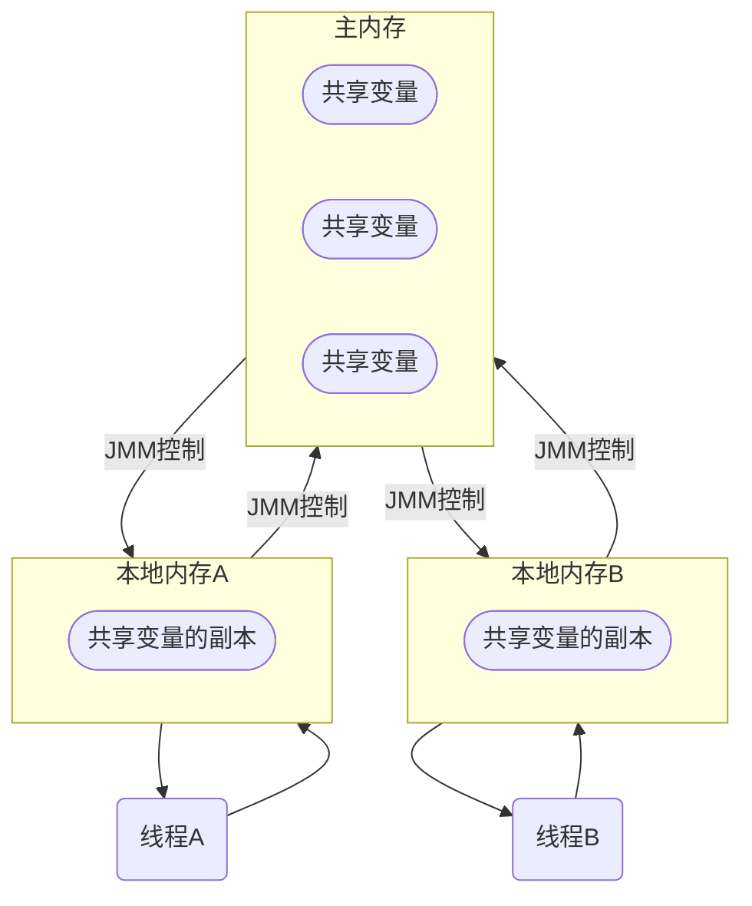
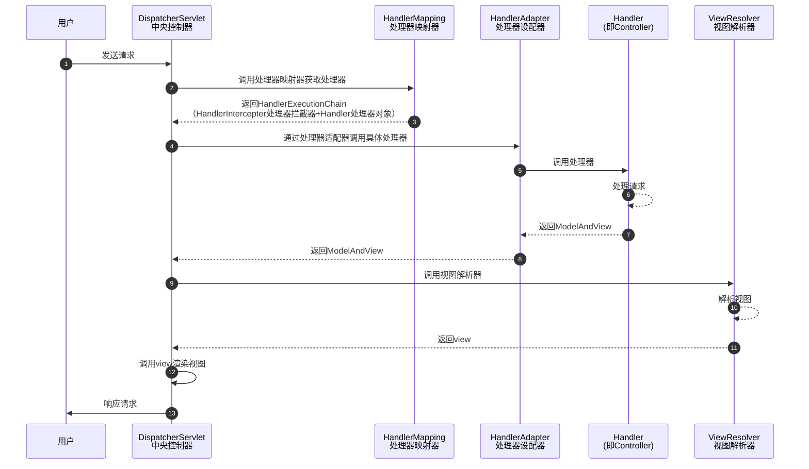

# Java面试题


## JVM

### JMM

#### 什么是JMM

JMM（Java内存模型Java Memery Model）本身一种抽象的概念**并不真实存在**，它描述的是一组规则或者规范，通过这组规范**定义了程序中各个变量的访问方式**。

JMM关于同步的规定：

- 线程解锁前，必须把共享变量的值刷新回主内存
- 线程加锁前，必须读取主内存的最新值到自己工作内存
- 加锁解锁是同一把锁



由于JVM运行程序的主体是内存，而**每个线程**创建时JVM都会为其创建一个**工作内存（或称栈空间）**，工作内存时每个线程的私有数据区域，而Java内存模型中规定所有变量都存储在主内存。主内存是共享内存区域，所有线程都可以访问，但线程对变量的操作（读写）必须在工作内存中进行，不能直接操作主内存的变量。首先要将变量从主内存拷贝到自己的工作内存，工作内存中此时持有**变量副本**，然后对**变量副本**进行操作，操作完成后再将变量写回主内存。各个进程之间无法访问对方的工作内存，线程间的通信（传值）必须通过主内存来完成。

JMM主要有三个特性（线程安全）：

- 可见性：当一个线程修改主内存里的共享变量，可以马上通知其他线程
- 原子性
- 有序性


## JUC

### 谈谈对volatile的理解

`volatile`是Java虚拟机提供的**轻量级的同步机制**（轻量级的synchronized），它主要有三个特性：

- 保证可见性：当一个线程修改主内存里的共享变量，可以马上通知其他线程（参考：[JMM内存模型的可见性](#什么是JMM)）
- 不保证原子性
- 禁止指令重排

`JMM`：Java内存模型（Java Memory Model）


## Spring

### Spring MVC的工作流程

Spring MVC处理模型数据的方式：

- 将方法返回值设置为`ModelAndView`

```java
@RequestMapping("/test")
public ModelAndView testModelAndView() {
    // 创建ModelAndView对象
    ModelAndView mav = new ModelAndView();
    // 设置模型数据，最终会放到request域中
    mav.putObject("user", "jho");
    // 设置视图
    mav.setViewName("success");
    return mav;
}
```

- 将方法返回值设置为`String`，在方法的入参种传入`Map`、`Model`、`ModelMap`。

```java
@RequestMapping("/test")
public String testMap(Map<String, Object> map) {
    // 向map中添加模型数据，最终会自动放到request域中
	map.put("user", new Employee(1, "jho", new Dept(1, "开发部")));
    return SUCCESS;
}
```

不管将处理器**方法的返回值**设置为`ModelAndView`还是在**方法的入参**中传入`Map`、`Model`、`ModelMap`，Spring MVC都会转换为一个`ModelAndView`对象。

Spring MVC的运行流程




## MyBatis