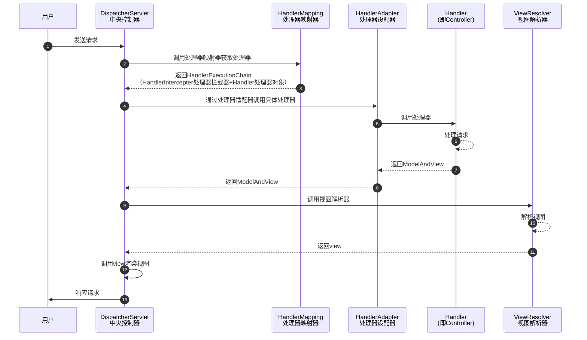

# Java面试题


## JVM

### JMM

#### 什么是JMM

了解一下[线程三大特性](#线程的三大特性)

JMM（Java内存模型Java Memery Model）本身一种抽象的概念**并不真实存在**，它描述的是一组规则或者规范，通过这组规范**定义了程序中各个变量的访问方式**。 **JMM就是围绕着并发过程中如何处理原子性、可见性和有序性这三个特征来定义的。**[来自：从线程三大特性深入理解JMM（Java 内存模型）](https://zhuanlan.zhihu.com/p/416172908)


JMM关于同步的规定：

- 线程解锁前，必须把共享变量的值刷新回主内存
- 线程加锁前，必须读取主内存的最新值到自己工作内存
- 加锁解锁是同一把锁


由于JVM运行程序的主体是内存，而**每个线程**创建时JVM都会为其创建一个**工作内存（或称栈空间）**，工作内存时每个线程的私有数据区域，而Java内存模型中规定所有变量都存储在主内存。主内存是共享内存区域，所有线程都可以访问，但线程对变量的操作（读写）必须在工作内存中进行，不能直接操作主内存的变量。首先要将变量从主内存拷贝到自己的工作内存，工作内存中此时持有**变量副本**，然后对**变量副本**进行操作，操作完成后再将变量写回主内存。各个进程之间无法访问对方的工作内存，线程间的通信（传值）必须通过主内存来完成。


## JUC

### 线程的三大特性

- 可见性：当一个线程修改主内存里的共享变量，可以马上通知其他线程。
- 原子性：数据在被一个线程执行的时候，**其他线程不可以同时再运行此数据**。即某个线程做某个具体业务，需要保证整体的完整，要么同时成功，要么同时失败。
- 有序性：CPU为保证内部处理器单元充分利用，会在单线程结果正确的前提之下，对代码指令进行非顺序执行，即**指令重排**。

#### 有序性

计算机再执行程序时，为了提供性能，编译器和处理器常常会对**指令做重排**，一般分为以下3种：

- 编译器优化的重排
- 指令并行的重排
- 内存系统的重排


单线程环境里面确保程序执行结果和代码顺序执行的结果一致。

处理器再进行重排序时必须要考虑指令之间的**数据依赖性**。

多线程环境中线程交替执行，由于编译器优化重排存在，两个线程中使用的变量能否保证一致性是无法确定的，结果无法预测。


### 谈谈对volatile的理解

`volatile`是Java虚拟机提供的**轻量级的同步机制**（轻量级的synchronized），它主要有三个特性：

- 保证可见性：当一个线程修改主内存里的共享变量，可以马上通知其他线程
- 不保证原子性
- 禁止指令重排

#### volatile的可见性

通过[JMM内存模型](#什么是JMM)可知，各个线程对主内存中共享变量的操作都是各个线程各自拷贝到自己的工作内存进行操作后，再写回主内存中的。这就可能存在线程A修改了共享变量但还未写回主内存，线程B也要修改同一个共享变量，但是线程A中工作内存中的共享变量对于线程B是不可见的，这种工作内存和主内存同步延迟的现象就会造成可见性问题，使用`volatile`就可以解决此类问题。

定义资源类

```java
/**
 * 资源类
 */
class Resource {

    /**
     * 使用volatile可以增强num变量在主内存和各内存的可见性，只要一个线程修改了主内存num值，其他线程可以马上收到通知，获取最新值
     * 若将此处的volatile关键字去掉发现，程序一致处于运行状态，即一直在main线程的while中循环等待
     */
    public volatile int num = 0;

    public void addNumTo10() {
        num += 10;
        System.out.println("【" + Thread.currentThread().getName() + "】num＋10");
    }

}
```

编写主程序

```java
/**
 * 验证volatile关键字的可见性
 */
public class VolatileVisibilityDemo {

    public static void main(String[] args) {
        Resource resource = new Resource();
        new Thread(() -> {
            try {
                TimeUnit.SECONDS.sleep(3);
            } catch (InterruptedException e) {
                e.printStackTrace();
            }
            resource.addNumTo10();
            System.out.println("【" + Thread.currentThread().getName() + "】操作完成");
        }, "线程A").start();
        while (resource.num == 0) {
            // 如果num值是0，main线程就在循环
        }
        System.out.println("【" + Thread.currentThread().getName() + "】num非0");
    }

}
```

输出

```bash
【线程A】num＋10
【线程A】操作完成
【main】num非0
```

以上案例运行输出表明，加了``volatile`关键字num值，**线程A**修改了主内存num值，**main线程**可以马上收到通知，获取最新值。

若将num值的`volatile`关键字去掉运行会发现，程序一致处于运行状态，即一直在**main线程**的while中循环等待。

#### volatile不保证原子性

定义资源类

```java
class MyData {

    private volatile int num = 0;

    private AtomicInteger atomicInteger = new AtomicInteger();

    public void incrAtom() {
        this.atomicInteger.getAndIncrement();
    }

    public void incr() {
        this.num++;
    }

    public int getNum() {
        return this.num;
    }

    public AtomicInteger getAtomicInteger() {
        return this.atomicInteger;
    }
}
```

编写主程序

```java
public class VolatileAtomicityDemo {

    public static void main(String[] args) {
        MyData data = new MyData();
        for (int i = 0; i < 20; i++) {
            new Thread(() -> {
                for (int j = 0; j < 1000; j++) {
                    data.incr();
                    data.incrAtom();
                }
            }, "第"  + i + "个线程").start();
        }
        // 等待所有线程计算完毕之后，打印最终num的值
        while (Thread.activeCount() > 2) {
            Thread.yield();
        }
        System.out.println("num计算结果：" + data.getNum());
        System.out.println("atomNum计算结果：" + data.getAtomicInteger());
    }

}
```

输出

```bash
num计算结果：17262
atomNum计算结果：20000
```

解决原子性问题

- 使用`synchronized`关键字
- 使用`juc`下的`AtomicInteger`


## Spring

### Spring MVC的工作流程

Spring MVC处理模型数据的方式：

- 将方法返回值设置为`ModelAndView`

```java
@RequestMapping("/test")
public ModelAndView testModelAndView() {
    // 创建ModelAndView对象
    ModelAndView mav = new ModelAndView();
    // 设置模型数据，最终会放到request域中
    mav.putObject("user", "jho");
    // 设置视图
    mav.setViewName("success");
    return mav;
}
```

- 将方法返回值设置为`String`，在方法的入参种传入`Map`、`Model`、`ModelMap`。

```java
@RequestMapping("/test")
public String testMap(Map<String, Object> map) {
    // 向map中添加模型数据，最终会自动放到request域中
	map.put("user", new Employee(1, "jho", new Dept(1, "开发部")));
    return SUCCESS;
}
```

不管将处理器**方法的返回值**设置为`ModelAndView`还是在**方法的入参**中传入`Map`、`Model`、`ModelMap`，Spring MVC都会转换为一个`ModelAndView`对象。

Spring MVC的运行流程




## MyBatis