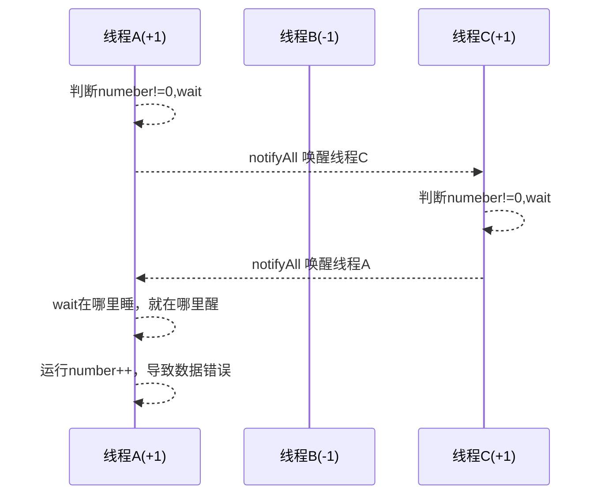
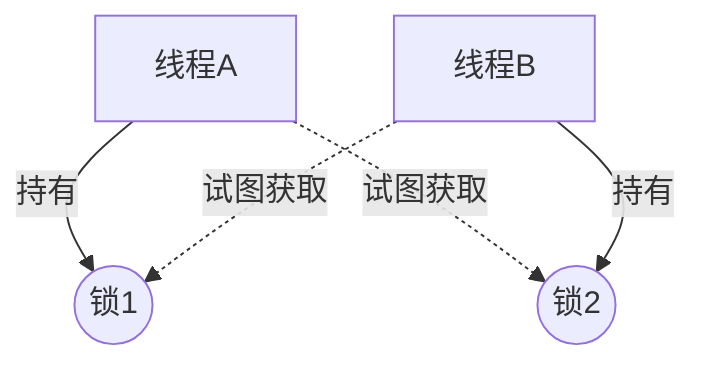
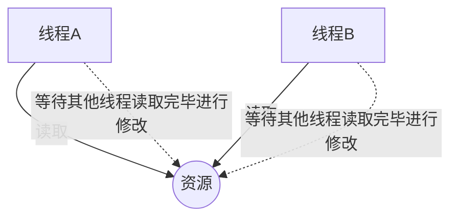
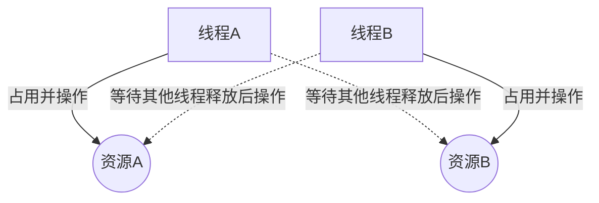

# JUC并发编程

代码示例地址：https://github.com/jho-yf/yf-java-learning/tree/main/yf-juc-learning

## JUC概述

### JUC简介

JUC就是`java.util.concurrent`工具包的简称，这是一个**处理线程**的工具包，JDK1.5开始出现。

### 线程和进程概念

**进程（Process）**是计算机中的程序关于某数据集合上的一次运行活动，是系统进行资源分配和调度的基本单位，是操作系统结构的基础。

**线程（Thread）**是操作系统能够进行运算调度的最小单位，它被包含在进程之中，是进程中的实际运作单位。

#### 进程和线程

一条**线程**指的是**进程**中一个单一顺序的控制流，一个**进程**中可以并发多个线程，每条**线程**并发执行不同的任务。

> 总的来说：
>
> - 进程：指在系统中正在运行的一个应用程序，程序一旦运行就是进程。
>   - 进程——**系统资源分配的最小单位**
> - 线程：系统分配处理器时间资源的基本单元，或者说进程之后独立执行一个单元执行流。
>   - 线程——**程序执行的最小单位**

### 线程的状态

#### 线程枚举类

```java
// java.lang.Thread.State
public enum State {
        /**
         * Thread state for a thread which has not yet started.
         */
        NEW,		// 新建

        /**
         * Thread state for a runnable thread.  A thread in the runnable
         * state is executing in the Java virtual machine but it may
         * be waiting for other resources from the operating system
         * such as processor.
         */
        RUNNABLE,	// 准备就绪

        /**
         * Thread state for a thread blocked waiting for a monitor lock.
         * A thread in the blocked state is waiting for a monitor lock
         * to enter a synchronized block/method or
         * reenter a synchronized block/method after calling
         * {@link Object#wait() Object.wait}.
         */
        BLOCKED,	// 阻塞

        /**
         * Thread state for a waiting thread.
         * A thread is in the waiting state due to calling one of the
         * following methods:
         * <ul>
         *   <li>{@link Object#wait() Object.wait} with no timeout</li>
         *   <li>{@link #join() Thread.join} with no timeout</li>
         *   <li>{@link LockSupport#park() LockSupport.park}</li>
         * </ul>
         *
         * <p>A thread in the waiting state is waiting for another thread to
         * perform a particular action.
         *
         * For example, a thread that has called <tt>Object.wait()</tt>
         * on an object is waiting for another thread to call
         * <tt>Object.notify()</tt> or <tt>Object.notifyAll()</tt> on
         * that object. A thread that has called <tt>Thread.join()</tt>
         * is waiting for a specified thread to terminate.
         */
        WAITING,	// 等待（不见不散）

        /**
         * Thread state for a waiting thread with a specified waiting time.
         * A thread is in the timed waiting state due to calling one of
         * the following methods with a specified positive waiting time:
         * <ul>
         *   <li>{@link #sleep Thread.sleep}</li>
         *   <li>{@link Object#wait(long) Object.wait} with timeout</li>
         *   <li>{@link #join(long) Thread.join} with timeout</li>
         *   <li>{@link LockSupport#parkNanos LockSupport.parkNanos}</li>
         *   <li>{@link LockSupport#parkUntil LockSupport.parkUntil}</li>
         * </ul>
         */
        TIMED_WAITING,		// 计时等待（过时不候）

        /**
         * Thread state for a terminated thread.
         * The thread has completed execution.
         */
        TERMINATED;			// 终结
    }
```

#### wait/sleep的区别

1. `sleep`是`Thread`的静态方法，`wait`是`Object`的方法，任何对象实例都能调用
2. `sleep`不会释放锁，它也不需要占用锁；`wait`会释放锁，但是调用它的前提是当前线程占有锁（即代码要在`synchronized`中）
3. 它们都可以被`interrupted`方法中断

### 并发和并行

> 对于单核CPU来说，同一时刻只能运行一个线程，只是CPU在线程之间切换执行指令速度很快，所以可以理解成为单核CPU可以同时运行多个线程。

**串行模式**：**串行**表示所有任务都一一按照先后顺序进行。

**并行模式**：**并行**意味着可以同时取得多个任务，并同时去执行所取得的这些任务。

**并发：并发（concurrent）指的是多个程序可以同时运行的现象，更细化的是多进程可以同时运行或者多指令可以同时运行**。

> 关于并行和并发的区别：[面试必考的：并发和并行有什么区别？](https://cloud.tencent.com/developer/article/1424249)
>
> 总的来说：
>
> - **并发**：同一时刻多个线程在访问同一个资源，**n个线程 vs 1个资源**
> - **并行**：多项工作同时执行后汇总
>
> 举例：
>
> ​	公司领导要求A、B、C三人完成一份需求文档，A负责写“背景”，C负责写“需求分析”，D负责写”系统设计“。
>
> ​	**并发**：公司里只有一台电脑，此时A先占用电脑写，写了一部分之后A去上厕所；B赶紧占用电脑继续写，写了一部分之后，B被领导叫走；C赶紧占用电脑继续写...
>
> ​	**并行**：A、B、C三人分别在各自电脑完成后，进行汇总。

### 管程

**管程 (英语：Monitors，也称为监视器)** 是一种程序结构，结构内的多个子程序（[对象](https://zh.wikipedia.org/wiki/对象_(计算机科学))或[模块](https://zh.wikipedia.org/wiki/模組_(程式設計))）形成的多个[工作线程](https://zh.wikipedia.org/wiki/工作_(資訊科學))互斥访问共享资源。（来自[维基百科：管程](https://zh.wikipedia.org/wiki/%E7%9B%A3%E8%A6%96%E5%99%A8_(%E7%A8%8B%E5%BA%8F%E5%90%8C%E6%AD%A5%E5%8C%96))）

> 管程是一种同步机制，保证同一时间，只有一个线程访问被保护数据或者代码，JVM同步是使用**管程**对象实现的

### 用户线程和守护线程

Java 中的线程分为两类，分别为**daemon 线程（守护线程）**和**user 线程（用户线程）**。（来自：[Java守护线程与用户线程的区别](https://juejin.cn/post/7020953597252730910)）

- 守护线程又称Daemon线程，运行在后台，看不见；(垃圾回收线程)
- 用户线程运行在前台，看的见。（自定义线程、main线程）

```java
// 以下示例运行结束发现，主线程（main）结束了，用户线程（myThread）还在运行，JVM存活
public class DaemonThreadDemo {

    public static void main(String[] args) {
        Thread myThread = new Thread(() -> {
            System.out.println(Thread.currentThread().getName() + "::" + Thread.currentThread().isDaemon());
            while (true) {

            }
        }, "myThread");
        myThread.start();

        System.out.println(Thread.currentThread().getName() + "结束...");
    }

}
```

将`myThread`设置成为守护线程

```java
// 以下示例运行结束发现，主线程（main）结束了，用户线程（myThread）也结束了，JVM结束
public class DaemonThreadDemo {

    public static void main(String[] args) {
        Thread myThread = new Thread(() -> {
            System.out.println(Thread.currentThread().getName() + "::" + Thread.currentThread().isDaemon());
            while (true) {

            }
        }, "myThread");

        // 设置守护线程，需要在start之前设置
        myThread.setDaemon(true);

        myThread.start();
        System.out.println(Thread.currentThread().getName() + "结束...");
    }

}
```

> 总结：
>
> - 若存在**任何一个用户线程未结束**，JVM存活。
>
> - 若**只剩下守护线程未结束**，JVM结束。


## Lock接口

Lock锁实现提供了比使用同步方法和语句可以获得的更广泛的锁操作。它们允许更灵活的结构，可能具有非常不同的属性，并且可能支持多个关联的条件对象。


### Synchronized

`synchronized`是Java中一个重要的关键字，是一种同步锁。它修饰的对象有以下几种：

> Java中每个对象都可以作为锁

**修饰代码块**，被修饰的代码块称为**同步语句块**，其作用范围是大括号{}括起来的代码，作用的对象是调用这个代码块的对象

```java
public void add() {
   synchronized(this) {
       i++;
   } 
}
```

**修饰方法**，被修饰的方法称为**同步方法**，其作用范围是整个方法，作用对象是调用这个方法的对象

```java
public synchronized void add() {
    i++;
}
```


> 使用`synchronized`来定义方法的时候，`synchronized`并不属于方法定义的一部分，因此，`synchronized`关键字不会被继承。也就是说，如果父类中某个方法使用了`synchronized`，而**子类覆盖了这个方法**，子类的这个方法默认情况下并不是同步的，而必须显式地在子类的这个方法上加上`synchronized`关键字。此外，如果在**子类调用父类的同步方法**，此时父类的同步方法也是可以生效的。

**修饰静态方法**，其作用范围是整个静态方法，作用的对象是这个类的所有对象。此时，synchronized加锁的对象为当前静态方法所在类的Class对象

```java
public static synchronized void add() {
    i++;
}
```

**修饰类**，其作用访问是Synchronized后面括号括起来的部分，作用的对象是这个类的所有对象

#### 售票示例（synchronized关键字实现）

创建资源类，定义属性和操作方法

```java
public class Ticket {

    private int number = 300;

    private final Random random = new Random();

    /**
     * 卖票
     */
    public synchronized void sale() {
        int i = random.nextInt(5);
        if (i > number) {
            // 若剩余票数小于要出售的票，只能卖出剩余的票数
            i = number;
        }
        if (number > 0) {
            number -= i;
            System.out.println(Thread.currentThread().getName() + "卖出：" + i + "，剩下：" + number);
        }
    }

}
```

创建多个线程，调用资源类的操作方法

```java
public class SaleTicket {

    public static void main(String[] args) {
        // 创建资源对象
        Ticket ticket = new Ticket();

        // 创建三个线程
        new Thread(() -> {
            for (int i = 0; i < 40; i++) {
                ticket.sale();
            }
        }, "售票员A").start();

        new Thread(() -> {
            for (int i = 0; i < 40; i++) {
                ticket.sale();
            }
        }, "售票员B").start();

        new Thread(() -> {
            for (int i = 0; i < 40; i++) {
                ticket.sale();
            }
        }, "售票员C").start();
    }

}
```


### Lock接口的使用

#### 售票示例(Lock接口实现)

创建资源类，定义属性和操作方法

```java
public class LockTicket {

    private int number = 300;

    private final Random random = new Random();

    /** 可重入锁 */
    private final ReentrantLock lock = new ReentrantLock();

    /**
     * 卖票
     */
    public void sale() {
        int i = random.nextInt(5);
        // 上锁
        lock.lock();
        try {
            if (i > number) {
                // 若剩余票数小于要出售的票，只能卖出剩余的票数
                i = number;
            }
            if (number > 0) {
                number -= i;
                System.out.println(Thread.currentThread().getName() + "卖出：" + i + "，剩下：" + number);
            }
        } finally {
            // 解锁
            lock.unlock();
        }

    }

}
```

创建多个线程，调用资源类的操作方法

```java
public class LockSaleTicket {

    public static void main(String[] args) {
        LockTicket lockTicket = new LockTicket();

        // 创建三个线程
        new Thread(() -> {
            for (int i = 0; i < 40; i++) {
                lockTicket.sale();
            }
        }, "售票员A").start();

        new Thread(() -> {
            for (int i = 0; i < 40; i++) {
                lockTicket.sale();
            }
        }, "售票员B").start();

        new Thread(() -> {
            for (int i = 0; i < 40; i++) {
                lockTicket.sale();
            }
        }, "售票员C").start();

    }

}
```

### Lock与synchronized的区别

- synchronized是Java语言的**关键字**，是内置特性。Lock是一个**类**，不是Java语言内置的。

- synchronized无需用户去手动释放锁，当synchronized方法或者synchronized代码块执行完之后，系统会**自动让线程释放对锁的占用**。Lock必须要用户去**手动释放锁**，如果没有主动释放锁，既有可能出现**死锁现象**。
- synchronized在发生异常时，会自动释放线程占有的锁，因此不会导致死锁现象发生。Lock在发生异常的时候，如果没有主动unLock()去释放锁，则很可能操作死锁现象，因此使用Lock时，**需在finally块中释放锁**。
- Lock可以让等待锁的线程响应中断，而synchronized不行，使用synchronized时，等待的线程会一直等待下去，不能够响应中断
- 通过Lock可以知道有没有成功获取锁，而synchronized不行
- Lock可以**提高多个线程进行读操作的效率**。从性能来说，如果竞争资源不激烈，两者性能差不多，而当竞争资源非常激烈时（即有大量线程同时竞争），Lock的性能要远优于synchronized。


### 创建线程的方式

#### 继承Thread类

```java
Thread t1 = new Thread(()-> {
    @Override
    public void run() {
        // ...
    }
});

class MyThread extents Thread {
    @Override
    public void run() {
        // ...
    }
}
Thread t2 = new MyThread();
```

#### 实现Runnable接口

```java
class RunnableImpl implements Runnable {
     @Override
    //重写run()方法
    public void run() {
        // ...
    }
}
Runnable r = new RunnableImpl();
Thread t = new Thread(r)
```

#### 使用Callable接口

```java
class CallableImpl implements Callable<String> {

    @Override
    public String call() throws Exception {
        return "callable返回值";
    }
    
}

new Thread(new FutureTask<String>(new CallableImpl()), "futureTask").start();
```


#### 实现线程池


## 线程间通信

#### synchronized实现方式

在资源类内，编写操作进行判断、干活、通知

```java
class Resource {

    /** 初始化值 */
    private int number = 0;

    /**
     * +1 操作
     */
    public synchronized void incr() throws InterruptedException {
        // 判断
        if (number != 0) {
            this.wait();
        }
        // 干活
        number++;
        System.out.println(Thread.currentThread().getName() + "::" + number);
        // 通知
        this.notifyAll();
    }

    /**
     * -1 操作
     */
    public synchronized void decr() throws InterruptedException {
        // 判断
        if (number != 1) {
            this.wait();
        }
        // 干活
        number--;
        System.out.println(Thread.currentThread().getName() + "::" + number);
        // 通知
        this.notifyAll();
    }


}
```

创建多个线程，调用资源类的操作方法

```java
public class SyncThreadNotifyDemo {

    public static void main(String[] args) {
        Resource resource = new Resource();
        Resource resource = new Resource();
        new Thread(() -> {
            for (int i = 0; i < 9; i++) {
                try {
                    resource.incr();
                } catch (InterruptedException e) {
                    e.printStackTrace();
                }
            }
        }, "线程A").start();

        new Thread(() -> {
            for (int i = 0; i < 9; i++) {
                try {
                    resource.decr();
                } catch (InterruptedException e) {
                    e.printStackTrace();
                }
            }
        }, "线程B").start();

        new Thread(() -> {
            for (int i = 0; i < 9; i++) {
                try {
                    resource.incr();
                } catch (InterruptedException e) {
                    e.printStackTrace();
                }
            }
        }, "线程C").start();

        new Thread(() -> {
            for (int i = 0; i < 9; i++) {
                try {
                    resource.decr();
                } catch (InterruptedException e) {
                    e.printStackTrace();
                }
            }
        }, "线程D").start();
    }

}
```

打印结果：出现BUG，不符合预期，这种现象称为**虚假唤醒**

```shell
线程A::1
线程B::0
线程A::1
线程C::0
线程B::-1
线程C::-2
线程B::-3
线程C::-4
线程B::-5
线程C::-6
...
```

#### 虚假唤醒（spurious wakeup）

当多个线程同时在**等待（wait）**的时候，调用**notifyAll()**方法会唤醒所有线程，但是有一个线程能够拿到控制权。

在线程的**等待/唤醒**的过程中，等待的线程被唤醒后，在条件（if）不满足的情况依然继续向下运行。



##### 解决方法

使用while循环，当线程获得锁后会再次对条件进行判断，避免在条件不满足的情况依然继续向下运行。

```java
    /**
     * +1 操作
     */
    public synchronized void incr() throws InterruptedException {
        // 判断
        while (number != 0) {
            this.wait();        // 唤醒之后，继续进行条件判断，避免资源操作错误
        }
        // 干活
        number++;
        System.out.println(Thread.currentThread().getName() + "::" + number);
        // 通知
        this.notifyAll();
    }

    /**
     * -1 操作
     */
    public synchronized void decr() throws InterruptedException {
        // 判断
        while (number != 1) {
            this.wait();
        }
        // 干活
        number--;
        System.out.println(Thread.currentThread().getName() + "::" + number);
        // 通知
        this.notifyAll();
    }
```


#### Lock锁实现方式

```java
class Resource {

    /** 初始化值 */
    private int number = 0;

    private final Lock lock = new ReentrantLock();

    private Condition condition = lock.newCondition();

    /**
     * +1操作
     */
    public void incr() throws InterruptedException {
        // 加锁
        lock.lock();
        try {
            // 判断
            while (number != 0) {
                condition.await();
            }
            number++;
            System.out.println(Thread.currentThread().getName() + "::" + number);
            // 通知
            condition.signalAll();
        } finally {
            lock.unlock();
        }
    }

    /**
     * -1操作
     */
    public void decr() throws InterruptedException {
        // 加锁
        lock.lock();
        try {
            // 判断
            while (number != 1) {
                condition.await();
            }
            number--;
            System.out.println(Thread.currentThread().getName() + "::" + number);
            // 通知
            condition.signalAll();
        } finally {
            lock.unlock();
        }
    }

}
```


## 线程间定制化通信

启动三个线程，线程A打印5次，线程B打印10次，线程C打印15次，循环10轮

编写资源类

```java
class ShareResource {

    public enum FLAG {
        /**
         * 标记A线程
         */
        A,
        /**
         * 标记B线程
         */
        B,
        /**
         * 标记C线程
         */
        C
    }

    private FLAG flag = FLAG.A;

    private Lock lock = new ReentrantLock();

    private Condition c1 = lock.newCondition();

    private Condition c2 = lock.newCondition();

    private Condition c3 = lock.newCondition();

    public void print5(int loop) throws InterruptedException {
        // 加锁
        lock.lock();
        try {
            // 判断
            while (flag != FLAG.A) {
                c1.await();
            }
            // 操作
            for (int i = 1; i <= 5; i++) {
                System.out.println("【第" + loop + "轮】" + Thread.currentThread().getName() + "::" + i);
            }
            this.flag = FLAG.B;
            c2.signal();
        } finally {
            lock.unlock();
        }
    }

    public void print10(int loop) throws InterruptedException {
        // 加锁
        lock.lock();
        try {
            // 判断
            while (flag != FLAG.B) {
                c2.await();
            }
            // 操作
            for (int i = 1; i <= 10; i++) {
                System.out.println("【第" + loop + "轮】" + Thread.currentThread().getName() + "::" + i);
            }
            this.flag = FLAG.C;
            c3.signal();
        } finally {
            lock.unlock();
        }
    }

    public void print15(int loop) throws InterruptedException {
        // 加锁
        lock.lock();
        try {
            // 判断
            while (flag != FLAG.C) {
                c3.await();
            }
            // 操作
            for (int i = 1; i <= 15; i++) {
                System.out.println("【第" + loop + "轮】" + Thread.currentThread().getName() + "::" + i);
            }
            this.flag = FLAG.A;
            c1.signal();
        } finally {
            lock.unlock();
        }
    }

}
```

创建多个线程，调用资源类的操作方法

```java
public class LockThreadCustomNotifyDemo {

    public static void main(String[] args) {
        ShareResource resource = new ShareResource();

        new Thread(() -> {
            for (int i = 1; i <= 10; i++) {
                try {
                    resource.print5(i);
                } catch (InterruptedException e) {
                    e.printStackTrace();
                }
            }
        }, "线程A").start();

        new Thread(() -> {
            for (int i = 1; i <= 10; i++) {
                try {
                    resource.print10(i);
                } catch (InterruptedException e) {
                    e.printStackTrace();
                }
            }
        }, "线程B").start();

        new Thread(() -> {
            for (int i = 1; i <= 10; i++) {
                try {
                    resource.print15(i);
                } catch (InterruptedException e) {
                    e.printStackTrace();
                }
            }
        }, "线程C").start();

    }

}
```


## 集合的线程安全

### ArrayList

#### 线程不安全演示

```java
public class ArrayListThreadDemo {

    public static void main(String[] args) {
        List<String> list = new ArrayList<>();
        for (int i = 0; i < 100; i++) {
            new Thread(() -> {
                list.add(UUID.randomUUID().toString().substring(0, 8));
                System.out.println(list);
            }, String.valueOf(i)).start();
        }
    }

}
```

抛出异常

```shell
Exception in thread "76" java.util.ConcurrentModificationException
	at java.base/java.util.ArrayList$Itr.checkForComodification(ArrayList.java:1043)
	at java.base/java.util.ArrayList$Itr.next(ArrayList.java:997)
	at java.base/java.util.AbstractCollection.toString(AbstractCollection.java:472)
	at java.base/java.lang.String.valueOf(String.java:2951)
	at java.base/java.io.PrintStream.println(PrintStream.java:897)
	at cn.jho.juc.collections.ListThreadDemo.lambda$main$0(ListThreadDemo.java:21)
	at java.base/java.lang.Thread.run(Thread.java:834)
```

`ArrayList`是线程不安全的

```java
// java.util.ArrayList
public boolean add(E e) {
    modCount++;
    add(e, elementData, size);
    return true;
}
```

#### 解决方案

List的线程安全解决方案一般有三种：`java.util.Vector`、`java.util.Collections#synchronizedList(java.util.List<T>)`、`java.util.concurrent.CopyOnWriteArrayList`。推荐使用：`CopyOnWriteArrayList`

##### Vector

```java
List<String> list = new Vector<>();
```

`Vector`是线程安全的

```java
// java.util.Vector
public synchronized boolean add(E e) {
    modCount++;
    add(e, elementData, elementCount);
    return true;
}
```

##### Collections工具类

```java
List<String> list = Collections.synchronizedList(new ArrayList<>());
```

##### CopyOnWriteArrayList

JUC提供了一个并发list就是`CopyOnWriteList`，是线程安全的（内部有一个独占锁`ReetrantLock`），采用**写时复制（并发读、独立写）**的策略。

```java
List<String> list = new CopyOnWriteArrayList<>();
```

```java
// java.util.concurrent.CopyOnWriteArrayList
public boolean add(E e) {
    // 加锁
    synchronized (lock) {
        // 获取数组和数组长度
        Object[] es = getArray();
        int len = es.length;
        // 将数组复制一份之后，插入新元素
        es = Arrays.copyOf(es, len + 1);
        es[len] = e;
        // 覆盖旧数组
        setArray(es);
        return true;
    }
    // 自动释放锁
}
```


### HashSet

#### 线程不安全演示

```java
public class HashSetThreadDemo {

    public static void main(String[] args) {
        Set<String> set = new HashSet<>();
        for (int i = 0; i < 100; i++) {
            new Thread(() -> {
                set.add(UUID.randomUUID().toString().substring(0, 8));
                System.out.println(set);
            }, String.valueOf(i)).start();
        }
    }

}
```

抛出异常

```shell
Exception in thread "95" java.util.ConcurrentModificationException
	at java.base/java.util.HashMap$HashIterator.nextNode(HashMap.java:1493)
	at java.base/java.util.HashMap$KeyIterator.next(HashMap.java:1516)
	at java.base/java.util.AbstractCollection.toString(AbstractCollection.java:472)
	at java.base/java.lang.String.valueOf(String.java:2951)
	at java.base/java.io.PrintStream.println(PrintStream.java:897)
	at cn.jho.juc.set.HashSetThreadDemo.lambda$main$0(HashSetThreadDemo.java:18)
```

`HashSet`是线程不安全的

```java
public boolean add(E e) {
    return map.put(e, PRESENT)==null;
}
```

#### CopyOnWriteArraySet

JUC提供了一个并发set就是`CopyOnWriteArraySet`，是线程安全的（内部有一个独占锁`ReetrantLock`），采用**写时复制（并发读、独立写）**的策略。

```java
Set<String> set = new CopyOnWriteArraySet<>();
```

### HashMap

#### 线程不安全演示

```java
public class HashMapThreadDemo {

    public static void main(String[] args) {
        Map<String, String> map = new HashMap<>();
        for (int i = 0; i < 100; i++) {
            String key = String.valueOf(i);
            new Thread(() -> {
                map.put(key, UUID.randomUUID().toString().substring(0, 8));
                System.out.println(map);
            }, key).start();
        }
    }

}
```

抛出异常

```shell
Exception in thread "60" Exception in thread "66" java.util.ConcurrentModificationException
	at java.base/java.util.HashMap$HashIterator.nextNode(HashMap.java:1493)
	at java.base/java.util.HashMap$EntryIterator.next(HashMap.java:1526)
	at java.base/java.util.HashMap$EntryIterator.next(HashMap.java:1524)
	at java.base/java.util.AbstractMap.toString(AbstractMap.java:551)
	at java.base/java.lang.String.valueOf(String.java:2951)
	at java.base/java.io.PrintStream.println(PrintStream.java:897)
	at cn.jho.juc.map.HashMapThreadDemo.lambda$main$0(HashMapThreadDemo.java:21)
```

`HashMap`是线程不安全的

```java
public V put(K key, V value) {
    return putVal(hash(key), key, value, false, true);
}
```

#### ConcurrentHashMap

JUC提供了一个并发set就是`ConcurrentHashMap`，是线程安全的（内部有一个独占锁`ReetrantLock`），采用**写时复制（并发读、独立写）**的策略。

```java
Map<String, String> map = new ConcurrentHashMap<>();
```


## 多线程锁

### 公平锁和非公平锁


### 可重入锁（递归锁）

`synchronized`（隐式）和`Lock`（显式）都是可重入锁。

#### 可重入锁演示

```java
// 可重入锁
Object o = new Object();
new Thread(() -> {
    synchronized (o) {
        System.out.println(Thread.currentThread().getName() + ":: 外层");
        synchronized (o) {
            System.out.println(Thread.currentThread().getName() + ":: 中层");
            synchronized (o) {
                System.out.println(Thread.currentThread().getName() + ":: 内层");
            }
        }
    }
}, "t1").start();
```

输出

```shell
t1:: 外层
t1:: 中层
t1:: 内层
```

#### 递归锁演示

```java
// 递归锁
public class RecursiveLockDemo {

    public synchronized void add() {
        add();
    }

    public static void main(String[] args) {
        new RecursiveLockDemo().add();
    }
}
```

输出

```shell
Exception in thread "main" java.lang.StackOverflowError
	at cn.jho.juc.reentrant.RecursiveLockDemo.add(RecursiveLockDemo.java:10)
	at cn.jho.juc.reentrant.RecursiveLockDemo.add(RecursiveLockDemo.java:10)
	at cn.jho.juc.reentrant.RecursiveLockDemo.add(RecursiveLockDemo.java:10)
	at cn.jho.juc.reentrant.RecursiveLockDemo.add(RecursiveLockDemo.java:10)
```

以上两个例子，证明`synchronized`是可重入锁。


### 死锁

**死锁**：指两个或两个以上的进程在执行过程中，由于竞争资源或者由于彼此通信而造成的一种阻塞的现象，若无外力作用，它们都将无法推进下去。



#### 产生死锁的原因

- 系统资源不足
- 进程运行推进顺序不合适
- 资源分配不当

#### 死锁示例

```java
public class DeadLock {

    static Object lock1 = new Object();
    static Object lock2 = new Object();

    public static void main(String[] args) {
        new Thread(() -> {
            synchronized (lock1) {
                System.out.println("【" + Thread.currentThread().getName() + "】持有lock1，试图获取lock2");
                try {
                    TimeUnit.SECONDS.sleep(1);
                } catch (InterruptedException e) {
                    e.printStackTrace();
                }
                synchronized (lock2) {
                    System.out.println("【" + Thread.currentThread().getName() + "】获取lock2");
                }
            }
        }, "线程A").start();

        new Thread(() -> {
            synchronized (lock2) {
                System.out.println("【" + Thread.currentThread().getName() + "】持有lock2，试图获取lock1");
                try {
                    TimeUnit.SECONDS.sleep(1);
                } catch (InterruptedException e) {
                    e.printStackTrace();
                }
                synchronized (lock1) {
                    System.out.println("【" + Thread.currentThread().getName() + "】获取lock1");
                }
            }
        }, "线程B").start();
    }

}
```

**输出**

```java
【线程A】持有lock1，试图获取lock2
【线程B】持有lock2，试图获取lock1
```

程序仍在运行种，且没有后续输出，因此产生死锁现象。

#### 验证死锁

- jps：显示jvm进程，类似Linux的`ps -ef`命令
- jstack：jvm自带堆栈跟踪工具

```shell
# 显示jvm进程
jps -l

16864 	cn.jho.juc.deadlock.DeadLock
19268 	org.jetbrains.jps.cmdline.Launcher
968 	jdk.jcmd/sun.tools.jps.Jps
10844
15516 	org.jetbrains.idea.maven.server.RemoteMavenServer36
3788 	org.jetbrains.idea.maven.server.RemoteMavenServer36

# 跟踪堆栈信息
jstack 16864

# 输出
2022-01-01 17:04:41
...
Found 1 deadlock.
```

最后面有一行输出`Found 1 deadlock.`，证明程序运行产生死锁。


## Callable接口

```java
package java.util.concurrent;

@FunctionalInterface
public interface Callable<V> {
    
    V call() throws Exception;
    
}
```

### Runnable接口和Callable接口

- `Runnable`接口方法`run`没有返回值，`Callable`接口方法`call`有返回值
- `Runnable`接口不会抛出异常，`Callable`接口会抛出异常

### Callable示例

```java
FutureTask<String> futureTask = new FutureTask<>(() -> {
    System.out.println(Thread.currentThread().getName() + "::Callable调用...");
    return "Callable返回值...";
});
new Thread(futureTask, "futureTask").start();

while (!futureTask.isDone()) {
    System.out.println("wait...");
}

System.out.println(futureTask.get());

// 输出
...
wait...
wait...
wait...
futureTask1::Callable调用...
wait...
wait...
wait...
Callable返回值...
```

### FatureTask原理


## JUC强大的辅助类


### CountDownLatch 减少计数

`CountdownLatch`类可以设置一个计数器，然后通过`countDown`方法来进行减1操作，使用`await`方法等待计数器不大于0，然后继续执行`await`方法之后的语句。

- 当一个或多个线程调用`await`方法时，这些线程会阻塞。
- 其他线程调用`countDown`方法会将计数器减1（调用`countDown`方法的线程不会阻塞）。
- 当计数器的值变成0时，因await方法阻塞的线程会被唤醒，继续执行。

示例：6个同学陆续离开之后，班长锁门

```java
 // 创建CountDownLatch对象，设置初始值
CountDownLatch countDownLatch = new CountDownLatch(6);

new Thread(() -> {
    try {
        countDownLatch.await();
    } catch (InterruptedException e) {
        e.printStackTrace();
    }
    System.out.println(Thread.currentThread().getName() + "锁门...");
}, "班长").start();

for (int i = 1; i <= 6; i++) {
    new Thread(() -> {
        System.out.println(Thread.currentThread().getName() + "离开教室...");

        // 计数-1
        countDownLatch.countDown();
    }, i + "号同学").start();
}

// 输出
1号同学离开教室...
2号同学离开教室...
6号同学离开教室...
5号同学离开教室...
4号同学离开教室...
3号同学离开教室...
班长锁门...
```


### CyclicBarrier 循环栅栏

`CyclicBarraier`：循环阻塞。`CyclicBarraier`的构造方法第一个参数就是目标障碍数，每次执行`CyclicBarraier`一次，计数就会加1，如果达到目标障碍数，才会执行`await`之后的语句。

示例：集齐7颗龙珠召唤神龙

```java
public class CyclicBarrierDemo {

    private static final int NUMBER = 7;

    public static void main(String[] args) {
        CyclicBarrier cyclicBarrier = new CyclicBarrier(NUMBER, () -> {
            System.out.println("集齐7颗龙珠，召唤神龙...");
        });

        for (int i = 1; i <= 7; i++) {
            new Thread(() -> {
                System.out.println(Thread.currentThread().getName() + "收集到...");
                try {
                    cyclicBarrier.await();
                } catch (InterruptedException e) {
                    e.printStackTrace();
                } catch (BrokenBarrierException e) {
                    e.printStackTrace();
                }
            }, i + "星龙珠").start();
        }

    }

}

// 输出
1星龙珠收集到...
5星龙珠收集到...
4星龙珠收集到...
3星龙珠收集到...
2星龙珠收集到...
7星龙珠收集到...
6星龙珠收集到...
集齐7颗龙珠，召唤神龙...
```


### Semaphore 信号灯

Semaphore 通常我们叫它信号量， 可以用来控制同时访问特定资源的线程数量，通过协调各个线程，以保证合理的使用资源。

可以把它简单的理解成我们停车场入口立着的那个显示屏，每有一辆车进入停车场显示屏就会显示剩余车位减1，每有一辆车从停车场出去，显示屏上显示的剩余车辆就会加1，当显示屏上的剩余车位为0时，停车场入口的栏杆就不会再打开，车辆就无法进入停车场了，直到有一辆车从停车场出去为止。

#### 使用场景

通常用于那些资源有明确访问数量限制的场景，常用于限流 。

比如：数据库连接池，同时进行连接的线程有数量限制，连接不能超过一定的数量，当连接达到了限制数量后，后面的线程只能排队等前面的线程释放了数据库连接才能获得数据库连接。

比如：停车场场景，车位数量有限，同时只能容纳多少台车，车位满了之后只有等里面的车离开停车场外面的车才可以进入。

（来自：[Semaphore 使用及原理](https://zhuanlan.zhihu.com/p/98593407)）

示例：6辆汽车，停3个车位

```java
 // 创建Semaphore，设置许可证数量为3
Semaphore semaphore = new Semaphore(3);

// 模拟6辆汽车
for (int i = 0; i < 6; i++) {
    new Thread(() -> {
        try {
            // 抢占
            semaphore.acquire();
            System.out.println(Thread.currentThread().getName() + "抢到了车位>>>");
            // 设置随机停车时间
            TimeUnit.SECONDS.sleep(new Random().nextInt(5));
            System.out.println(Thread.currentThread().getName() + "离开了车位《《《");
        } catch (InterruptedException e) {
            e.printStackTrace();
        } finally {
            // 释放
            semaphore.release();
        }
    }, i + "车").start();
}

// 输出
0车抢到了车位>>>
2车抢到了车位>>>
3车抢到了车位>>>
3车离开了车位《《《
5车抢到了车位>>>
5车离开了车位《《《
1车抢到了车位>>>
0车离开了车位《《《
4车抢到了车位>>>
1车离开了车位《《《
4车离开了车位《《《
2车离开了车位《《《
```


## ReetrantReadWriteLock 读写锁

### 读锁和写锁

**读写锁**：一个资源可以被**多个读线程**访问，或者可以被一个**写线程**访问，但不能同时存在读写线程，**读写互斥，读读共享**。

读锁是**共享锁**，写锁是**独占锁**，两者都会发生**死锁**。

- **共享锁**：能够被多个线程共同持有

- **独占锁**：一次只能被一个线程持有

#### 读写锁示例

```java
class Cache {

    private volatile Map<String, Object> map = new HashMap<>();

    /** 读写锁 */
    private final ReadWriteLock rwLock = new ReentrantReadWriteLock();

    public void put(String key, Object value) {
        // 加写锁
        rwLock.writeLock().lock();
        try {
            System.out.println(Thread.currentThread().getName() + ":正在写操作..." + key);
            TimeUnit.MILLISECONDS.sleep(300);
            map.put(key, value);
            System.out.println(Thread.currentThread().getName() + ":完成写操作..." + key);
        } catch (InterruptedException e) {
            e.printStackTrace();
        } finally {
            // 释放写锁
            rwLock.writeLock().unlock();
        }
    }

    public Object get(String key) {
        // 加读锁
        rwLock.readLock().lock();
        Object result = null;
        try {
            System.out.println(Thread.currentThread().getName() + ":正在读取操作..." + key);
            TimeUnit.MILLISECONDS.sleep(300);
            result = map.get(key);
            System.out.println(Thread.currentThread().getName() + ":完成读取操作..." + result);
        } catch (InterruptedException e) {
            e.printStackTrace();
        } finally {
            rwLock.readLock().unlock();
        }
        return result;
    }

} 	 

public class ReadWriteLockDemo {

    public static void main(String[] args) throws InterruptedException {
        Cache cache = new Cache();
        for (int i = 1; i <= 3; i++) {
            final int num = i;
            new Thread(() -> {
                cache.put("key" + num, "value" + num);
            }, "ThreadPut" + i).start();
        }

        TimeUnit.SECONDS.sleep(1);

        for (int i = 1; i <= 3; i++) {
            final int num = i;
            new Thread(() -> {
                cache.get("key" + num);
            }, "ThreadPut" + i).start();
        }
    }

}

// 输出
ThreadPut1:正在写操作...key1
ThreadPut1:完成写操作...key1
ThreadPut3:正在写操作...key3
ThreadPut3:完成写操作...key3
ThreadPut2:正在写操作...key2
ThreadPut2:完成写操作...key2
ThreadPut1:正在读取操作...key1
ThreadPut3:正在读取操作...key3
ThreadPut2:正在读取操作...key2
ThreadPut2:完成读取操作...value2
ThreadPut3:完成读取操作...value3
ThreadPut1:完成读取操作...value1
```

从输出可以看出，**写锁是独占锁**，**读锁是共享锁**


#### 读锁的死锁现象

**共享锁**：线程A、B都去读取同一个资源。线程A修改资源，需要等待线程B读取完成；线程B修改资源，需要线程A读取完成。



#### 写锁的死锁现象

**独占锁**：一个线程可以同时操作多个资源



#### 读写锁演变

| 锁                              | 优点                               | 缺点                                                         |
| ------------------------------- | ---------------------------------- | ------------------------------------------------------------ |
| 无锁                            | 效率快                             | 多线程抢夺同一个资源，容易造成资源混乱                       |
| `synchronized`和`ReentrantLock` | 每次只能有一个线程来操作           | 都是独占锁，效率慢                                           |
| `ReentrantReadWriteLock`        | 读取共享锁，写入独占锁，提升性能。 | 容易造成**锁饥饿**，一直读，没有写<br />读的时候不能写，只有读取完成之后才可以写<br />写操作可以读 |

#### 读写锁的降级

读写锁在读取的时候不能进行写操作，只有读取操作完成之后才可以进行写操作。写操作可以进行读取操作。

**锁降级过程：**


**锁降级：**将写锁降级为读锁。

```java
// 可重入读写锁对象
ReentrantReadWriteLock rwLock = new ReentrantReadWriteLock();
// 读锁
ReentrantReadWriteLock.ReadLock readLock = rwLock.readLock();
// 写锁
ReentrantReadWriteLock.WriteLock writeLock = rwLock.writeLock();

// 获取写锁
writeLock.lock();
System.out.println("正在写入...");

// 获取读锁
readLock.lock();
System.out.println("正在读取...");

writeLock.unlock();
System.out.println("写锁释放...");
readLock.unlock();
System.out.println("读锁释放...");

// 输出
正在写入...
正在读取...
写锁释放...
读锁释放...
```

调整顺序将读锁升级为写锁

```java
// 可重入读写锁对象
ReentrantReadWriteLock rwLock = new ReentrantReadWriteLock();
// 读锁
ReentrantReadWriteLock.ReadLock readLock = rwLock.readLock();
// 写锁
ReentrantReadWriteLock.WriteLock writeLock = rwLock.writeLock();

// 获取读锁
readLock.lock();
System.out.println("正在读取...");

// 获取写锁
writeLock.lock();
System.out.println("正在写入...");

readLock.unlock();
System.out.println("读锁释放...");
writeLock.unlock();
System.out.println("写锁释放...");

// 输出
正在读取...
```

以上示例，读锁一直没有释放，无法进行往下运行。

**不能将读锁升级为写锁**


### 悲观锁和乐观锁

### 表锁和行锁


## BlockingQueue 阻塞队列

### 概述

**队列**：先进先出

**栈**：先进后出

**阻塞**：在多线程领域，某些情况下会**挂起线程（即阻塞）**，一旦条件满足，被挂起的线程又会被自动唤起。

**阻塞队列**：一个共享队列，使得数据由队列的一端输入，从另一端输出


- 当队列是空的，从队列中获取元素的操作（Take）将会被阻塞，直到其他线程往空队列插入新的元素
- 当队列是满的，从队列中添加元素的操作（Put）将会被阻塞

### 阻塞队列的架构


### 阻塞队列分类

### 阻塞队列核心方法


## ThreadPool 线程池


## Fork/Join 分支合并框架


## CompletableFuture 异步回调


## 其他

### 多线程编程步骤

1. 创建资源类，在资源类创建属性和操作方法
2. 在资源类操作方法
   - 判断
   - 干活
   - 通知
3. 创建多个线程，调用资源类的操作方法
3. 防止[虚假唤醒](#虚假唤醒（spurious wakeup）)


### `new Thread().start()`之后线程是否会马上创建

不一定会马上创建，调用`start()`方法之后，Java会交由操作系统启动线程，但是操作系统不一定会马上启动线程，需要看操作系统的闲忙状况。由以下代码可以知道，调用`start()`方法时，`start()`方法会去调用一个被`native`修饰的`start0()`方法。

`native`关键字说明其修饰的方法是一个原生态方法，方法对应的实现不是在当前文件，而是在用其他语言（如C和C++）实现的文件中。Java语言本身不能对操作系统底层进行访问和操作，但是可以通过JNI接口调用其他语言来实现对底层的访问。(来自：[java中native的用法](https://www.cnblogs.com/b3051/p/7484501.html))

```java
package java.lang;

public class Thread implements Runnable {
    
    private native void start0();
    
	public synchronized void start() {
    	// ...
        start0();
        // ...
    }
}
```

