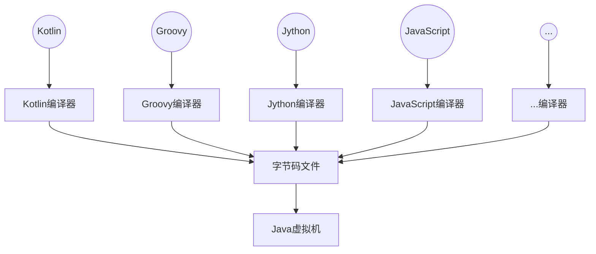
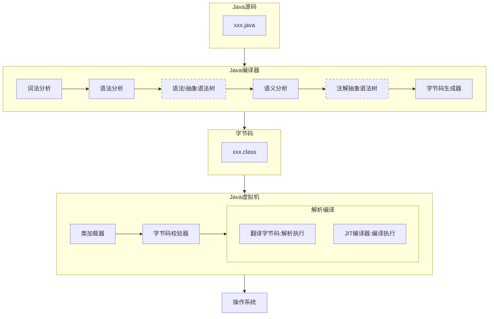
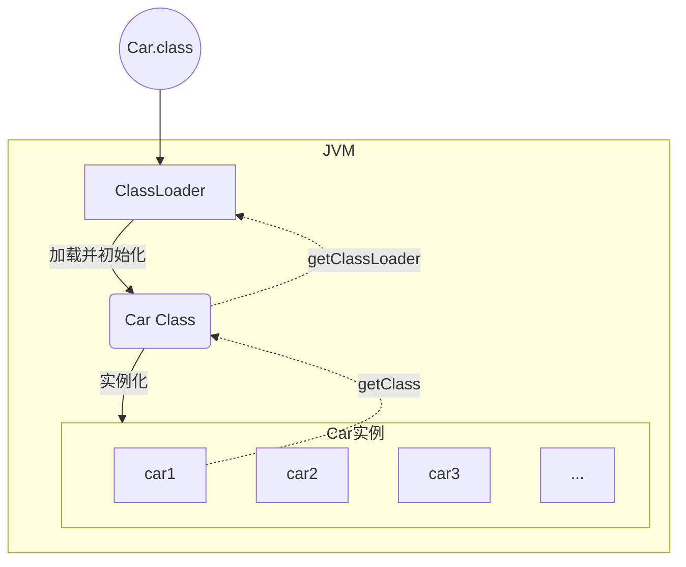
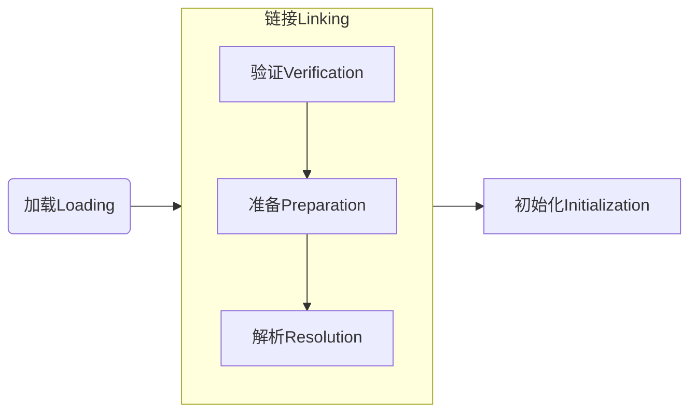
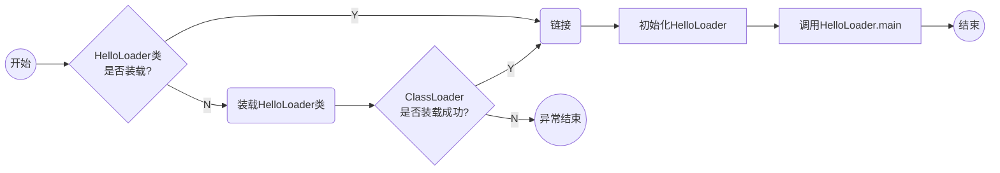
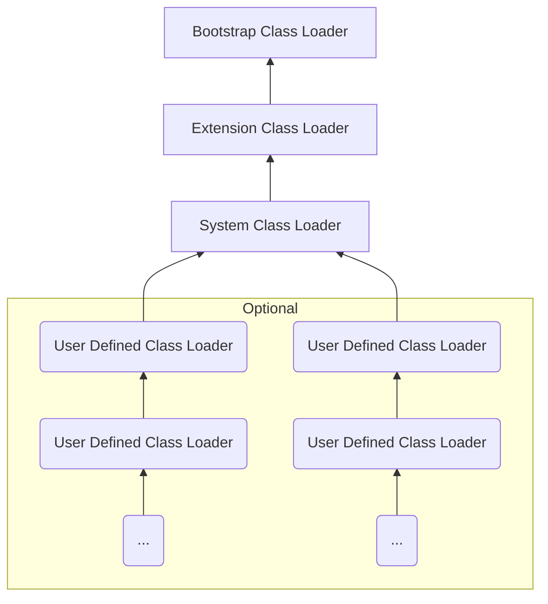
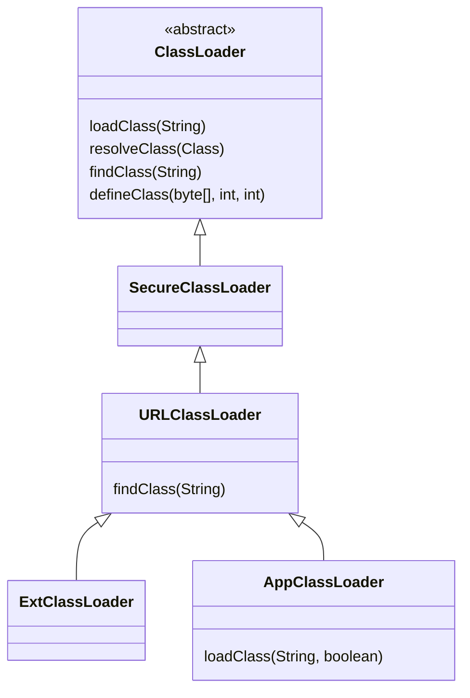

# Java虚拟机(JVM)


## JVM上篇 - 内存与垃圾回收

### 1. JVM与Java体系结构

#### 官方资料及相关书籍

官方资料

- [Java/JVM规范](https://docs.oracle.com/javase/specs/index.html)

书籍

- 《深入理解Java虚拟机》
- 《深入理解JVM&G1 GC》
- 《揭秘Java虚拟机》
- 《Java虚拟机基础教程》
- 《实战Java虚拟机》
- 《Java虚拟机精讲》
- 《码出高效 Java开发手册》
- 《自己动手写Java虚拟机》


#### Java以及JVM简介

##### JVM：跨语言的平台




Java虚拟机无需关心运行在其内部的程序到底是使用何种编程语言编写的，它只关心“字节码”文件。也就是说Java虚拟机拥有语言无关性，并不会单纯地与Java语言“终生绑定”，只要其他编程语言的编译结果满足并包含Java虚拟机的内部指令集、符号表以及其他的辅助信息，它就是一个有效的字节码文件，就能够被虚拟机所识别并装载。

##### 字节码

**Java字节码**：指的是用Java语言编译成的字节码。准确的说任何能在JVM平台上执行的字节码格式都是一样的。

不同的编译器可以编译出相同的字节码文件，字节码文件也可以在不同的JVM上面运行。


#### 虚拟机与Java虚拟机

##### 虚拟机

所谓虚拟机（Virtual Machine），就是一台虚拟的计算机。它是一款软件，用来执行一系列虚拟计算机指令。大体上虚拟机可以分为**系统虚拟机**和**程序虚拟机**。无论是系统虚拟机还是程序虚拟机，在其上面运行的软件都被限制于 虚拟机提供的资源中。

系统虚拟机：是完全对物理计算机的仿真，提供了一个可运行完整操作系统的软件平台。如：Visual Box，VMware

程序虚拟机：是专门为执行单个计算机程序而设计的。如：Java虚拟机，在Java虚拟机中执行的指令就称为Java字节码指令。

##### Java虚拟机

Java虚拟机是一台执行Java字节码的虚拟计算机，它拥有独立的运行机制，其运行的Java字节码也未必由Java语言编译而成。

JVM平台的各种语言可以共享Java虚拟机带来的**跨平台**、**优秀的垃圾回收器**，以及**可靠的即时编译器**。

**Java技术的核心就是Java虚拟机**（JVM，Java Virtual Machine），因为所有的Java程序都运行在Java虚拟机内部。

###### 作用

**Java虚拟机就是二进制字节码的运行环境**，负责装载字节码到其内部，解释/编译为对应平台上的机器指令执行。每一条Java指令，Java虚拟机规范中都有详细定义，如：怎么去操作数、怎么处理操作数、处理结果放在哪里。

###### 特点

- 一次编译，处处运行
- 自动内存管理
- 自动垃圾回收功能

###### JVM的位置

JVM运行在操作系统上，与硬件没有直接的交互


#### JVM的整体结构


#### Java代码的执行流程



- Java编译器编译过程中，任何一个节点执行失败就会造成编译失败。

- 虽然各个平台的Java虚拟机内部实现细节不尽相同，但是他们共同执行的字节码内容确实一样的。

- JVM的主要任务就是负责将字节码装载到其内部，解释/编译为对应平台上的机器指令（即：汇编语言）执行。

- Java虚拟机使用类加载器（Class Loader）装载class文件。

- 类加载完成之后，会进行字节码校验，字节码校验通过之后，JVM解释器会把字节码翻译成机器语言（即：汇编语言）交由操作系统执行。

- 但不是所有代码都是解释执行的，JVM对此做了优化。


#### JVM的架构模型

Java编译器输入的指令流基本上是一种**基于栈的指令集架构**，另外一种指令集架构则是**基于寄存器的指令架构**。

##### 基于栈式架构

- 设计和实现更简单，适用于资源受限的系统。比如嵌入式设备、机顶盒、打印机等。
- 避开了寄存器的分配难题，使用**零地址指令**方式分配
- 指令流中的指令大部分是零地址指令，其执行过程依赖于操作栈。指令集更小，编译器容易实现。
- 不需要硬件支持，可以可移植性更好，更好实现跨平台。

##### 基于寄存器架构

- 典型的应用是x86的二进制指令集。比如：传统PC、Android的Davlik虚拟机
- 指令集架构则完全依赖硬件，可移植性差
- 性能优秀、执行更高效
- 花费更少的指令取完成一项操作
- 在大部分情况下，基于寄存器架构的指令集往往都以**一地址指令、二地址指令和三地址指令**为主，而基于栈式的指令集却是以零地址指令为主。

##### 举例

###### 执行2+3的逻辑操作

基于栈式架构

```java
iconst_2	// 常量2入栈
istore_1	
iconst_3	// 常量3入栈
istore_2
iload_1
iload_2
iadd 		//常量2/3出栈，执行相加
istore_0 	// 结果5入栈
```

基于寄存器架构

```java
mov eax,2 	//将eax寄存器的值设为1
add eax,3 	//使eax寄存器的值加3
```

##### 总结

由于跨平台性的设计，Java的指令都是根据栈来设计的。不同平台CPU架构不同，所以不能设计为基于寄存器的。优点是跨平台、指令集小，编译器容易实现。缺点是性能下降，实现同样的功能需要更多指令。


#### JVM的生命周期

##### 虚拟机的启动

Java虚拟机的启动是通过引导类加载器（`bootstrap class loader`）创建一个初始类（`initial class`）来完成的，这个类是由虚拟机的具体实现来指定的。

##### 虚拟机的执行

- 一个运行中Java虚拟机有着一个清晰的任务：**执行Java程序**
- 程序开始执行时，JVM才运行。程序结束时，JVM就停止。
- **执行一个所谓的Java程序时，真正执行的时一个叫Java虚拟机的进程。**

**虚拟机的退出**

有如下几种情况：

- 程序正常执行结束
- 程序在执行过程中遇到了异常或者错误而终止
- 由于操作系统出现错误而导致Java虚拟机进程终止
- 某线程调用`Runtime`类或`System`类的`exit`方法，或`Runtime`类的`halt`方法，并且Java安全管理器也允许这次`exit`或`halt`操作
- 除此之外，`JNI`（Java Native Interface）规范描述了用`JNI Invocation API`来加载或卸载Java虚拟机时，Java虚拟机的退出情况。


#### JVM的发展历程

##### Sun Classic VM

- 早在1996年Java1.0版本的时候，Sun公司发布了一款名为sun classic VM的Java虚拟机，它同时也是世界上第一款商用Java虚拟机，JDK1.4时完全被淘汰。

- 这款虚拟机内部只提供解释器。现在还有及时编译器，因此效率比较低，而及时编译器会把热点代码缓存起来，那么以后使用热点代码的时候，效率就比较高。

- 如果使用JIT编译器，就需要进行外挂。但是一旦使用了JIT编译器，JIT就会接管虚拟机的执行系统。解释器就不再工作。解释器和编译器不能配合工作。

- 现在hotspot内置了此虚拟机。

##### Exact VM

- 为了解决上一个虚拟机问题，jdk1.2时，Sun提供了此虚拟机。

  Exact Memory Management：准确式内存管理

  也可以叫Non-Conservative/Accurate Memory Management

- 虚拟机可以知道内存中某个位置的数据具体是什么类型。

- 具备现代高性能虚拟机的维形

  热点探测

  编译器与解释器混合工作模式

- 只在solaris平台短暂使用，其他平台上还是classic vm

  英雄气短，终被Hotspot虚拟机替换

##### HotSpot VM

- HotSpot历史

- 最初由一家名为“Longview Technologies”的小公司设计

- 1997年，此公司被sun收购；2009年，Sun公司被甲骨文收购。

- JDK1.3时，HotSpot VM成为默认虚拟机

- 目前Hotspot占有绝对的市场地位，称霸武林。

- 不管是现在仍在广泛使用的JDK6，还是使用比例较多的JDK8中，默认的虚拟机都是HotSpot

- Sun / Oracle JDK 和 OpenJDK 的默认虚拟机

- 因此本课程中默认介绍的虚拟机都是HotSpot，相关机制也主要是指HotSpot的Gc机制。（比如其他两个商用虚机都没有方法区的概念）

- 从服务器、桌面到移动端、嵌入式都有应用。

- 名称中的HotSpot指的就是它的热点代码探测技术。

- 通过计数器找到最具编译价值代码，触发即时编译或栈上替换

- 通过编译器与解释器协同工作，在最优化的程序响应时间与最佳执行性能中取得平衡

##### JRockit

- 专注于服务器端应用

- 它可以不太关注程序启动速度，因此JRockit内部不包含解析器实现，全部代码都靠即时编译器编译后执行。

- 大量的行业基准测试显示，JRockit JVM是世界上最快的JVM。

- 使用JRockit产品，客户已经体验到了显著的性能提高（一些超过了70%）和硬件成本的减少（达50%）。

- 优势：全面的Java运行时解决方案组合

- JRockit面向延迟敏感型应用的解决方案JRockit Real Time提供以毫秒或微秒级的JVM响应时间，适合财务、军事指挥、电信网络的需要

- MissionControl服务套件，它是一组以极低的开销来监控、管理和分析生产环境中的应用程序的工具。

- 2008年，JRockit被oracle收购。

- Oracle表达了整合两大优秀虚拟机的工作，大致在JDK8中完成。整合的方式是在HotSpot的基础上，移植JRockit的优秀特性。

- 高斯林：目前就职于谷歌，研究人工智能和水下机器人

##### IBM的J9

- 全称：IBM Technology for Java Virtual Machine，简称IT4J，内部代号：J9

- 市场定位与HotSpot接近，服务器端、桌面应用、嵌入式等多用途VM

- 广泛用于IBM的各种Java产品。

- 目前，有影响力的三大商用虚拟机之一，也号称是世界上最快的Java虚拟机。

- 2017年左右，IBM发布了开源J9VM，命名为openJ9，交给EClipse基金会管理，也称为Eclipse OpenJ9

##### KVM和CDC / CLDC Hotspot

- Oracle在Java ME产品线上的两款虚拟机为：CDC/CLDC HotSpot Implementation VM

- KVM（Kilobyte）是CLDC-HI早期产品

- 目前移动领域地位尴尬，智能机被Android和iOS二分天下。

- KVM简单、轻量、高度可移植，面向更低端的设备上还维持自己的一片市场

- 智能控制器、传感器

- 老人手机、经济欠发达地区的功能手机

- 所有的虚拟机的原则：一次编译，到处运行。

##### Azul VM

- 前面三大“高性能Java虚拟机”使用在通用硬件平台上这里Azul VW和BEA Liquid VM是与特定硬件平台绑定、软硬件配合的专有虚拟机

- 高性能Java虚拟机中的战斗机。

- Azul VM是Azul Systems公司在HotSpot基础上进行大量改进，运行于Azul Systems公司的专有硬件Vega系统上的Java虚拟机。

- 每个Azul VM实例都可以管理至少数十个CPU和数百GB内存的硬件资源，并提供在巨大内存范围内实现可控的GC时间的垃圾收集器、专有硬件优化的线程调度等优秀特性。

- 2010年，AzulSystems公司开始从硬件转向软件，发布了自己的Zing JVM，可以在通用x86平台上提供接近于Vega系统的特性。

##### Liquid VM

- 高性能Java虚拟机中的战斗机。

- BEA公司开发的，直接运行在自家Hypervisor系统上

- Liquid VM即是现在的JRockit VE（Virtual Edition），**Liquid VM不需要操作系统的支持，或者说它自己本身实现了一个专用操作系统的必要功能，如线程调度、文件系统、网络支持等。**

- 随着JRockit虚拟机终止开发，Liquid vM项目也停止了。

##### Apache Harmony

- Apache也曾经推出过与JDK1.5和JDK1.6兼容的Java运行平台Apache Harmony。

- 它是IBM和Intel联合开发的开源JVM，受到同样开源的OpenJDK的压制，Sun坚决不让Harmony获得JCP认证，最终于2011年退役，IBM转而参与OpenJDK

- 虽然目前并没有Apache Harmony被大规模商用的案例，但是它的Java类库代码吸纳进了Android SDK。

##### Micorsoft JVM

- 微软为了在IE3浏览器中支持Java Applets，开发了Microsoft JVM。

- 只能在Windows平台下运行。但确是当时Windows下性能最好的Java VM。

- 1997年，Sun以侵犯商标、不正当竞争罪名指控微软成功，赔了Sun很多钱。微软WindowsXP SP3中抹掉了其VM。现在Windows上安装的jdk都是HotSpot。

##### Taobao JVM

- 由AliJVM团队发布。阿里，国内使用Java最强大的公司，覆盖云计算、金融、物流、电商等众多领域，需要解决高并发、高可用、分布式的复合问题。有大量的开源产品。

- 基于OpenJDK 开发了自己的定制版本AlibabaJDK，简称AJDK。是整个阿里Java体系的基石。

- 基于OpenJDK Hotspot VM发布的国内第一个优化、深度定制且开源的高性能服务器版Java虚拟机。

- 创新的GCIH（GC invisible heap）技术实现了off-heap，即将生命周期较长的Java对象从heap中移到heap之外，并且GC不能管理GCIH内部的Java对象，以此达到降低GC的回收频率和提升GC的回收效率的目的。

- GCIH中的对象还能够在多个Java虚拟机进程中实现共享

- 使用crc32指令实现JVM intrinsic 降低JNI 的调用开销

- PMU hardware 的Java profiling tool 和诊断协助功能

- 针对大数据场景的ZenGc

- taobao vm应用在阿里产品上性能高，硬件严重依赖intel的cpu，损失了兼容性，但提高了性能

- 目前已经在淘宝、天猫上线，把oracle官方JVM版本全部替换了。

##### Dalvik VM

- 谷歌开发的，应用于Android系统，并在Android2.2中提供了JIT，发展迅猛。

- Dalvik VM只能称作虚拟机，而不能称作“Java虚拟机”，它没有遵循 Java虚拟机规范，不能直接执行Java的Class文件

- 基于寄存器架构，不是jvm的栈架构。

- 执行的是编译以后的dex（Dalvik Executable）文件。执行效率比较高。

- 它执行的dex（Dalvik Executable）文件可以通过class文件转化而来，使用Java语法编写应用程序，可以直接使用大部分的Java API等。

- Android 5.0使用支持提前编译（Ahead of Time Compilation，AoT）的ART VM替换Dalvik VM。

##### Graal VM

- 2018年4月，oracle Labs公开了Graal VM，号称 "Run Programs Faster Anywhere"，野心勃勃。与1995年java的”write once，run anywhere"遥相呼应。

- Graal VM在HotSpot VM基础上增强而成的跨语言全栈虚拟机，可以作为“任何语言” 的运行平台使用。语言包括：Java、Scala、Groovy、Kotlin；C、C++、Javascript、Ruby、Python、R等

- 支持不同语言中混用对方的接口和对象，支持这些语言使用已经编写好的本地库文件

- 工作原理是将这些语言的源代码或源代码编译后的中间格式，通过解释器转换为能被Graal VM接受的中间表示。Graal VM提供Truffle工具集快速构建面向一种新语言的解释器。在运行时还能进行即时编译优化，获得比原生编译器更优秀的执行效率。

- 如果说HotSpot有一天真的被取代，Graal VM希望最大。但是Java的软件生态没有丝毫变化

##### 总结

具体JVM的内存结构，其实取决于其实现，不同厂商的JVM，或者同一厂商发布的不同版本，都有可能存在一定差异。主要以Oracle HotSpot VM为默认虚拟机。


### 2. 类加载子系统


#### 类加载器子系统作用

- 类加载器子系统负责从文件系统或者网络中加载Class文件，class文件在文件开头有特定的文件标识。
- ClassLoader只负责class文件的加载，至于它是否可以运行，则有Execution Engine执行引擎决定。
- 加载的类信息存放于一块称为方法区的内存空间。除了类信息之外，方法区中还会存放运行时常量池信息，可能还包括字符串常量和数字常量（这部分常量信息是Class文件中常量池部分的内存映射）


#### 类加载器ClassLoader角色



- class file存在于本地硬盘上，可以理解为设计师画在纸上的模板，而最终这个模板在执行的时候是要加载到JVM当中来，根据这个文件实例化出n个一模一样的实例。
- class file加载到JVM中，被称为DNA元数据模板，放在方法区。
- 在`.class`文件 -> JVM -> 最终成为元数据模板，此过程就要一个运输工具（类装载器ClassLoader），扮演一个快递员的角色。


#### 类的加载过程



##### 示例

代码

```java
public class HelloLoader {

    public static void main(String[] args) {
      	System.out.println("hello world");
    }

}
```

步骤



##### 加载Loading

1. 通过一个类的全限定名获取定义此类的二进制字节流
2. 将这个字节流所代表的静态存储结构转化为方法区的运行时数据结构
3. 在内存中生成一个代表这个类的java.lang.Class对象，作为方法区这个类的各种数据的访问入口

##### 链接Linking

###### 验证Verify

目的在于确保Class文件的字节流中包含信息符合当前虚拟机要求，保证被加载类的正确性，不会危害虚拟机自身安全

主要包括四种验证：文件格式验证、元数据验证、字节码验证、符号引用验证

###### 准备Prepare

为类变量分配内存并且设置改类变量的默认初始值，即零值

这里不包含用`final`修饰的`static`，因为`final`在编译的时候就会分配了，准备阶段会显式初始化

这里不会为实例变量分配初始化，类变量会分配在方法区中，而实例变量是会随着对象一起分配到Java堆中。

```java
// prepare：a = 0
// initial：a = 1
private static int a = 1;
```

###### 解析Resolve

将常量池内的符号引用转换为直接引用的过程。

事实上，解析操作往往会伴随着JVM在执行完初始化之后在执行。

符号引用就是一组符号来描述所引用的目标。符号引用的字面量形式明确定义在《Java虚拟机规范》的Class文件格式中。直接引用就是直接指向目标的指针、相对偏移量或一个间接定位到目标的句柄。

解析动作主要针对类或接口、字段、类方法、接口方法、方法类型等。对应常量池中的`CONSTANT_Class_info`、`CONSTANT_Fieldref_info`、`CONSTANT_Methodref_info`等

##### 初始化Initialization

**初始化阶段就是执行类构造器方法`<clinit>()`的过程**

`<clinit>()`方法不需定义，是`javac`编译器自动收集类中的所有类变量的赋值动作和静态代码块中的语句合并而来。

构造器方法`<clinit>()`中指令按照语句在源文件中出现的顺序执行。

`<clinit>()`不同于类构造器。

若该类具有父类，JVM会保证子类的`<clinit>()`执行前，父类的`<clinit>()`已经执行完毕。

虚拟机必须保证一个类的`<clinit>()`方法在多线程下被同步加锁。

##### 加载.class文件的方式

- 从本地系统中直接加载
- 通过网络获取，典型场景：Web Applet
- 从zip压缩包中读取，jar包、war包
- 运行时计算生成，典型场景：动态代理技术
- 由其他文件生成，典型场景：JSP应用
- 从专有数据库中提取.class文件
- 从加密文件中获取，典型的防Class文件被反编译的保护措施


#### 类加载器分类

JVM支持两种类型的类加载器，分别为：**引导类加载器（Bootstrap ClassLoader）**、**自定义类加载器（User-Defined ClassLoader）**

> 自定义类加载器：所有派生于抽象类`ClassLoader`的类加载器都划分为自定义类加载器



以上四种类加载器之间的关系不是包含关系。不是上层下层，也不是父子类的继承关系。

##### 示例

代码

```java
public class ClassLoaderTest {

    public static void main(String[] args) {
        // 获取系统类加载器
        ClassLoader systemClassLoader = ClassLoader.getSystemClassLoader();
        System.out.println(systemClassLoader);

        // 获取扩展类加载器
        ClassLoader extClassLoader = systemClassLoader.getParent();
        System.out.println(extClassLoader);

        // 获取引导类加载器
        ClassLoader bootstrapClassLoader = extClassLoader.getParent();
        System.out.println(bootstrapClassLoader);

        // 用户自定义类：默认使用系统类加载器进行加载
        ClassLoader classLoader = ClassLoaderTest.class.getClassLoader();
        System.out.println(classLoader);

        // String类使用引导类加载器进行加载，Java核心类库都是用引导类加载器进行加载
        ClassLoader classLoader1 = String.class.getClassLoader();
        System.out.println(classLoader1);
    }

}
```

输出

```sh
sun.misc.Launcher$AppClassLoader@18b4aac2
sun.misc.Launcher$ExtClassLoader@1b6d3586
null
sun.misc.Launcher$AppClassLoader@18b4aac2
null
```

##### 虚拟机自带的加载器

###### 启动类加载器（引导类加载器，Bootstrap ClassLoader）

- 启动类加载器使用**C/C++语言**实现，嵌套在JVM内部
- 启动类加载器用于加载Java的核心库（`JAVA_HOME/jre/lib/rt.jar`、`resources.jar`、`sun.boot.class.path`路径下的内容），用于提供JVM自身需要的类
- 启动类加载器并不继承于`java.lang.ClassLoader`，没有父加载器
- 启动类加载器能够加载**扩展类加载器**和**应用程序类加载器**，并指定为他们的父类加载器
- 出于安全考虑，启动类加载器只加载包名为`java`、`javax`、`sun`等开头的类 

###### 扩展类加载器（Extension ClassLoader）

- 扩展类加载器使用**Java语言**实现，由`sun.misc.Launcher$ExtClassLoader`实现
- 扩展类加载器派生于`ClassLoader`类
- 扩展类加载器的父类加载器为启动类加载器
- 扩展类加载器从`java.ext.dirs`系统属性所指定的目录中加载类库，或从JDK的安装目录的`jre/lib/ext`子目录（扩展目录）下加载类库。**如果用户的jar放在此目录下，也会自动由扩展类加载器加载**

###### 应用程序类加载器（系统类加载器，AppClassLoader）

- 应用程序类加载器使用**Java语言**实现，由`sun.misc.Launcher$AppClassLoader`实现
- 应用程序类加载器派生于`ClassLoader`类
- 应用程序类加载器的父类加载器为扩展类加载器
- 应用程序类加载器复杂加载环境变量classpath或系统属性`java.class.path`指定路径下的类库
- 应用程序类加载器是程序中默认的类加载器，一般来说，Java应用的类都是由它来完成

###### 示例

代码

```java
public class ClassLoaderTest1 {

    public static void main(String[] args) {
        // 获取BootstrapClassLoader能够加载的api路径
        System.out.println("***********BootstrapClassLoader能够加载的api路径***********");
        URL[] urls = Launcher.getBootstrapClassPath().getURLs();
        for (URL url : urls) {
            System.out.println(url.toExternalForm());
        }

        System.out.println("***********java包下任意一个类的ClassLoader***********");
        ClassLoader classLoader = Provider.class.getClassLoader();
        System.out.println(classLoader);

        System.out.println("***********扩展类加载器能够加载的路径***********");
        String extDirs = System.getProperty("java.ext.dirs");
        for (String path : extDirs.split(";")) {
            System.out.println(path);
        }
    }

}
```

输出

```shell
***********BootstrapClassLoader能够加载的api路径***********
file:/D:/DevEnv/Java/jdk8/jre/lib/resources.jar
file:/D:/DevEnv/Java/jdk8/jre/lib/rt.jar
file:/D:/DevEnv/Java/jdk8/jre/lib/sunrsasign.jar
file:/D:/DevEnv/Java/jdk8/jre/lib/jsse.jar
file:/D:/DevEnv/Java/jdk8/jre/lib/jce.jar
file:/D:/DevEnv/Java/jdk8/jre/lib/charsets.jar
file:/D:/DevEnv/Java/jdk8/jre/lib/jfr.jar
file:/D:/DevEnv/Java/jdk8/jre/classes
***********java包下任意一个类的ClassLoader***********
null
***********扩展类加载器能够加载的路径***********
D:\DevEnv\Java\jdk8\jre\lib\ext
C:\Windows\Sun\Java\lib\ext

```

##### 用户自定义类加载器

###### 主要作用

- 隔离加载类：让每个模块使用独立的类加载器来加载，这样不同模块之间的依赖就不会互相影响，从而避免类冲突（[如何实现Java类隔离加载？](https://developer.aliyun.com/article/780697)）
- 修改类加载的方式
- 扩展加载源
- 防止源码泄露

###### 实现用户自定义加载类

- 继承抽象类`java.lang.ClassLoader`类，扩展自定义需求
- 覆盖`findClass()`方法，将自定义的类加载逻辑写在里面
- 在编写自定义类加载器时，如果没有太过复杂的需求，可以直接继承`URLClassLoader`类，这样就可以避免自己去编写`fingClass()`方法及其获取字节码流的方式，使自定义类加载器编写更加简洁。

```java
public class CustomClassLoader extends ClassLoader {

    @Override
    protected Class<?> findClass(String name) throws ClassNotFoundException {
        try {
            byte[] result = getClassFromCustomPath(name);
            if (result == null) {
                throw new FileNotFoundException();
            } else {
                return defineClass(name, result, 0, result.length);
            }
        } catch (FileNotFoundException e) {
            e.printStackTrace();
        }

        return super.findClass(name);
    }

    private byte[] getClassFromCustomPath(String name) {
        // 从自定义路径中加载指定类
        // 如果指定路径字节码文件被加密，在此处需要进行解密
        return null;
    }

    public static void main(String[] args) {
        CustomClassLoader classLoader = new CustomClassLoader();
        try {
            Class<?> clazz = Class.forName("One", true, classLoader);
            Object obj = clazz.newInstance();
            System.out.println(obj.getClass().getClassLoader());
        } catch (Exception e) {
            e.printStackTrace();
        }
    }

}
```


#### 关于ClassLoader

ClassLoader类是一个抽象类，其后所有的类加载器都继承自`ClassLoader`（不包括启动类加载器`BootstrapClassLoader`）



| 方法名称                                               | 描述                                                         |
| ------------------------------------------------------ | ------------------------------------------------------------ |
| `getParent()`                                          | 返回该类加载器的超类加载器                                   |
| `loadClass(String name)`                               | 加载名称为name的类，返回结果为`java.lang.Class`类的实例      |
| `findClass(String name)`                               | 查找名称为name的类，返回结果为`java.lang.Class`类的实例      |
| `findLoadedClass(String name)`                         | 查找名称为name的已经被加载过的类，返回结果为`java.lang.Class`类的实例 |
| `defineClass(String name, byte[] b, int off, int len)` | 把字节数组b中的内容转换为一个Java类，返回结果为`java.lang.Class`类的实例 |
| `resolveClass(Class<?> clazz)`                         | 连接指定的一个Java类                                         |

##### 获取ClassLoader的途径

```java
// 方式一：获取当前类的classLoader
clazz.getClassLoader();
    
// 方式二：获取当前线程上下文的ClassLoader
Thread.currentThread().getContextClassLoader();

// 方式三：获取系统的ClassLoader
ClassLoader.getSystemClassLoader();

// 方式四：获取调用者的ClassLoader
DriverManager.getCallerClassLoader();
```


#### 双亲委派机制

Java虚拟机对Class文件采用的是**按需加载**的方式，也就是说当需要使用该类时才会将它的class文件加载到内存生成Class对象。而且加载某个类的class文件时，Java虚拟机采用的是**双亲委派模式**，即把请求交由父类处理，它是一种任务委派模式。

##### 工作原理


- 如果一个类加载器收到类加载请求，它并不会自己先去加载，而是把这个请求委托给父类的加载器去执行加载。
- 如果父类加载器还存在其父类加载器，则会进一步向上委托，依次递归，请求最终将到达顶层的启动类加载器。
- 如果父类加载器可以完成类加载任务，就成功返回，倘若父类加载器无法完成此加载任务，子加载器才会依次尝试去加载。

##### 工作原理验证

###### 代码1

手动新建`java.lang.String`类

```java
package java.lang;

public class String {

    static {
        System.out.println("自定义String类静态代码块加载...");
    }

}
```

编写测试类

```java
public class StringTest {

    public static void main(String[] args) {
        java.lang.String s = new java.lang.String();
        System.out.println("双亲委派机制演示...");
    }

}
```

###### 输出1

```sh
双亲委派机制演示...
```


###### 代码2

```java
// 手动新建java.lang.String类
package java.lang;

public class String {

    static {
        System.out.println("自定义String类静态代码块加载...");
    }

    public static void main(String[] args) {
        System.out.println("hello");
    }

}
```

###### 输出2

```sh
错误: 在类 java.lang.String 中找不到 main 方法, 请将 main 方法定义为:
   public static void main(String[] args)
否则 JavaFX 应用程序类必须扩展javafx.application.Application
```


###### 代码3

```java
public class YfStarter {

    public static void main(String[] args) {
        System.out.println("hello!yf starter");
    }

}
```

###### 输出3

```shell
java.lang.SecurityException: Prohibited package name: java.lang
```


###### 结论

- 由于双亲委派机制，String类要加载需要向上委托至启动类加载器BootstrapClassLoader，BootstrapClassLoader负责加载`java.lang`包底下的所有类，因此将Java源码库底下的`java.lang.String`类加载了，因此[代码1](#代码1)中的自定义的`java.lang.String`类并没有被加载，所以该类静态方法也不会被执行。Java源码库底下的`java.lang.String`类并没有`main()`方法，因此[代码2](#代码2)输出以上[输出2所示错误](#输出2)。
- `java.LANG`限制包名,不能自定义类在此包名下，会与java类库冲突，安全管理器不通过，因此因此[代码3](#代码3)输出以上[输出3所示错误](#输出3)。

> **沙箱安全机制**：将 Java 代码限定在虚拟机(JVM)特定的运行范围中，并且严格限制代码对本地系统资源访问，通过这样的措施来保证对代码的有效隔离，防止对本地系统造成破坏。

##### 优势

- 避免类的重复加载
- 保护程序安全，防止核心API被随意篡改


#### 其他

##### 判断两个Class对象是否为同一个类的必要条件

在JVM中表示两个class对象是否为同一个类存在的两个**必要条件**：

- 类的完整类名必须一致，包括包名。
- 加载这个类的ClassLoader（指ClassLoader实例对象）必须相同。

也就是说，在JVM中即使两个类对象（Class对象）来源于同一个Class文件，被同一个虚拟机所加载，但只要加载他们的ClassLoader实例对象不同，那么这两个类对象也是不相等的。

##### 对类加载器的引用

JVM必须直到一个类是由启动类加载器加载的还是用户类加载器加载的。如果一个类是由用户类加载器加载的，那么JVM**会将这个类加载器的一个引用作为类信息的一部分保存在方法区中**。当解析一个类型到另一个类型的引用的时候，JVM需要保证这两个类型的类加载器是相同的。

##### Java程序对类的使用方式

Java程序对类的使用方式有**主动使用**和**被动使用**，它们之间主要的区别是**会不会导致类的初始化**。

###### 主动使用

对类的主动使用，会导致类的初始化。主动使用，又分为其中情况：

- 创建类的实例
- 访问某个类或接口的静态变量，或者对该静态变量赋值
- 调用类的静态方法
- 反射（如：`Class.forName("com.jho.Test")`）
- 初始化一个类的子类
- Java虚拟机启动时，被表明为启动类的类
- JDK7开始提供的动态语言支持
  - `java.lang.invoke.MethodHandle`实例的解析结果
  - `REF_getStatic`、`REF_putStatic`、`REF_invokeStatic`句柄对应的类没有初始化，则初始化

###### 被动使用

对类的被动使用，不会导致类的初始化。

## JVM中篇 - 字节码与类的加载


## JVM下篇 - 性能监控与调优


## 面试