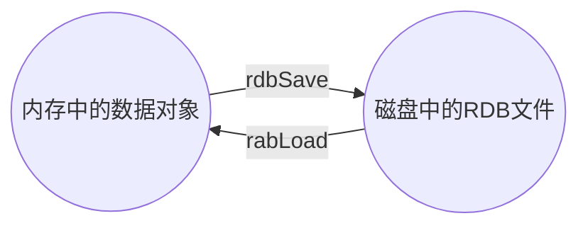
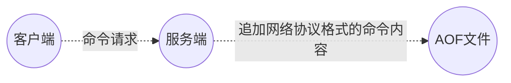

# 中间件面试题

## Redis

### Redis持久化有几种类型以及他们之间的区别

Redis提供两种不同形式的持久化方式：**RDB**（Redis Database）和**AOF**（Append Of File）

#### RDB

在指定的时间间隔内将内存中的**数据集快照**写入磁盘，也就是`Snapshot`快照，它恢复时是将快照文件直接读到内存中。

**备份如何执行：**Redis会单独创建（fork）一个子进程来进行持久化，会先将数据写入到一个临时文件中，待持久化过程都结束了，再用这个临时文件替换上次持久化好的文件。整个过程中，主进程是不进行任何IO操作的，这就确保了极高的性能，且对于数据恢复的完整性不是非常敏感。

**优点：**

- RDB方式会比AOF方式更加的高效，恢复速度快。
- 节省磁盘空间。

**缺点：**

- 虽然Redis在fork时使用写时拷贝技术，但是在数据量庞大的时候还是比较耗性能的。
- 在一定时间间隔做一次备份，如果Redis意外宕机的话，就会丢失最后一次快照的所有修改。

#### AOF

以**日志的形式来记录每个写操作**，将Redis执行过的所有**写指令都记录下来（读操作不记录）**，只许追加日志文件但不可以改写日志文件，Redis启动之初会读取该文件重新构建数据。换言之，Redis重启的话就根据日志文件的内容，将写指令从前到后执行一次以完成数据的恢复工作。

**优点：**

- 备份机制更稳健，丢失数据概率更低
- 可读的日志文本，通过操作AOF文件，可以处理误操作

**缺点：**

- 比RDB占用更多的磁盘空间
- 恢复备份速度比较慢
- 每次读写都同步的话，会有一定的性能压力
- 存在个别BUG，造成无法恢复

