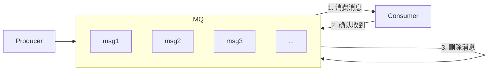

# Kafka

Kafka是一个开源的分布式事件流平台（Event Streaming Platform），用于高性能数据管道、流分析、数据集成和关键任务应用。

> 发布/订阅：消息的发布者不会将消息直接发送给特定的订阅者，而是将发布的消息分为不同的类别，订阅者只接收感兴趣的消息。


## 消息队列

### 应用场景

传统消息队列主要应用场景：**缓存/消峰**、**解耦**和**异步通信**。

**缓存/消峰**：有助于控制和优化数据流经过系统的速度，解决生产消息和消费消息的处理速度不一致的情况。

**解耦**：允许独立的扩展或修改两边的处理过程，只需确保两边都遵守同样的接口约束。

**异步通信**：允许用户把一个消息放入队列，但并不立即处理它们，然后在需要的时候再去处理它们。

### 两种模式

**点对点模式**：消费者主动拉取数据，消息收到之后删除消息。



**发布/订阅模式**：

- 可以有多个主题（topic）
- 消费者消费数据之后，不删除数据
- 每个消费者相互独立，都可以消费数据


## 基础架构


- 为方便扩展并提高吞吐量，一个`topic`分为多个`partition`
- 配合分区的设计，提出消费者组的概念，组内每个消费者并行的消费消息
- 为提高可用性，为每个`partition`增加若干副本
- 消费消息只针对`Leader`，`Follower`只作为副本。`Leader`挂掉了之后，`Follower`才有资格成为`Leader`去消费消息。
- zookeeper中记录谁是`Leader`，在2.8之后，Kafka可脱离zookeeper独立运行。

## 相关配置

`server.properties`重要配置参数

```properties
# broker的唯一标识，不能重复
broker.id=0

# 存放kafka数据日志
log.dirs=/tmp/kafka-logs

# zookeeper连接
zookeeper.connect=zk1:2181,zk2:2181,zk3:2181/kafka
```

## 命令操作

`topic`命令：用于创建、删除、查询、修改一个主题

```shell
./bin/kafka-topics.sh
```

`consumer`命令：用于从`topic`读取并格式化数据

```shell
./bin/kafka-console-consumer.sh
```


## 生产者

主线程：创建`Producer`对象，此过程中可以添加拦截器`Interceptor`实现自定义业务逻辑，然后将数据发送给序列化器`Serializer`进行序列化，再将分区器`Partitioner`将数据发送到对应分区

消息累加器`RecordAccumulator`，缓存队列：默认大小为32m，每批次大小

Sender线程：

- 读取数据并发送数据，满足以下条件其中一个则发送数据

  - 数据累积到`batch.size`，默认16k

  - 等待`linger.ms`之后就会发送数据，单位：ms，默认值为0，表示没有延迟。

- `InFlightRequests`请求缓存队列：缓存已经发送但还没收到响应的`ClientRequest`，一个node对应一个分区

- `Selector`：打通`RecordAccumulator`和`Broker`进行消息传输

Broker进行应答acks

- 0：生产者发送过来的数据，不需要等数据落盘应答
- 1：生产者发送过来的数据，Leader收到数据后应答
- -1(all)：生产者发送过来的数据，Leader和ISR队列里面的所有结点收齐数据后应答。-1和all等价。


## Kafka分区的好处

- **便于合理使用存储资源**，每个Partition在一个Broker上存储，可以把海量的数据按照分区切割成一块一块数据存储在堕胎Broker上面。合理控制分区的任务，可以实现**负载均衡**的效果。
- **提高并行度**，生产者可以以分区为单位发送数据；消费者可以以分区为单位进行消费数据。


