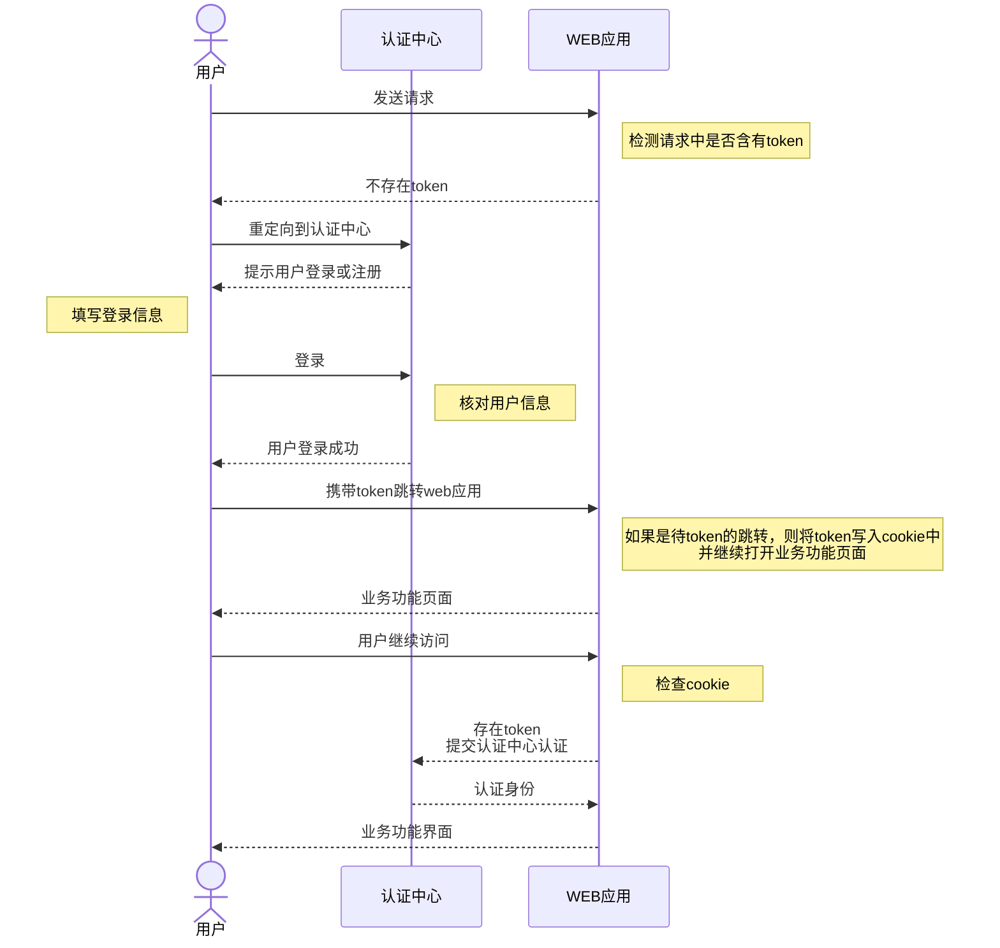

# 项目技术面试题

## 认证与授权

### 单点登录

#### 单点登录的实现过程

**单点登录：**一处登录，多处使用。（单点登录多使用在分布式系统中）

```mermaid
sequenceDiagram
	actor user as 用户
	participant auth as 认证中心
    participant web as WEB应用
    user ->> web: 发送请求
    Note right of web: 检测请求中是否含有token
    web -->> user: 不存在token
    user ->> auth : 重定向到认证中心
    auth -->> user : 提示用户登录或注册
    Note left of user: 填写登录信息
    user ->> auth : 登录
    Note right of auth: 核对用户信息
    auth -->> user : 用户登录成功
    user ->> web : 携带token跳转web应用
    Note right of web: 如果是待token的跳转，则将token写入cookie中<br />并继续打开业务功能页面
    web -->> user: 业务功能页面
    user ->> web: 用户继续访问
    Note right of web: 检查cookie
    web -->> auth: 存在token<br />提交认证中心认证
    auth -->> web: 认证身份
    web -->> user: 业务功能界面
```

