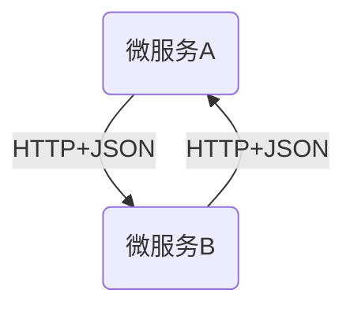
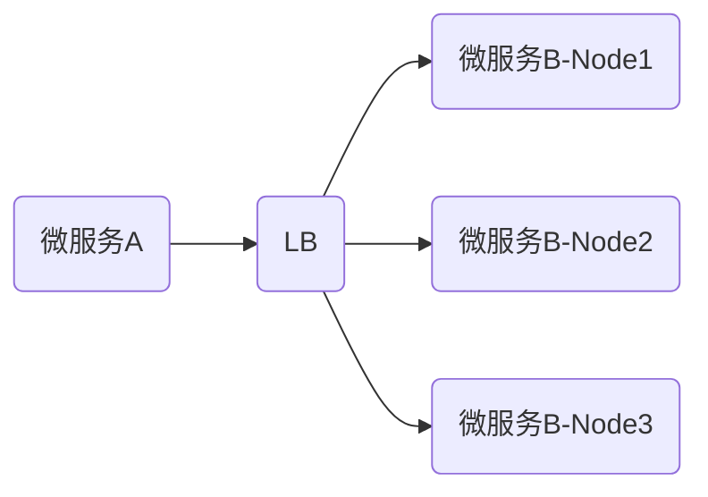

# 乙方商城

> 学习资源来自：
>
> - 尚硅谷 https://www.bilibili.com/video/BV1np4y1C7Yf?from=search&seid=8255707087993128567&spm_id_from=333.337.0.0
> 
>   
>
> 笔记整理参考：
>
> - https://blog.csdn.net/unique_perfect/article/details/111392634
> - https://blog.csdn.net/unique_perfect/article/details/113824202
> - https://blog.csdn.net/unique_perfect/article/details/114035775

## 项目简介

- 乙方商城是一个B2C模式的电商平台，类似京东，销售自营商品给客户

### 电商模式

市面上有5种常见的电商模式`B2B`、`B2C`、`C2B`、`C2C`、`O2O`

- `B2B`模式：B2B(Business to Business)，指商家与商家建立的商业关系。如：阿里巴巴
- `B2C`模式：B2C(Business to Consumer)，即“商对客”模式，就是通常说的商业零售，直接面对消费者销售产品和服务。如：苏宁易购、京东、天猫
- `C2B`模式：C2B(Customer to Business)，即消费者对企业，先有消费者需求产生而后有企业生产，即先有消费者提出需求，后又生产企业按需求组织生产
- `C2C`模式：C2C(Customer to Consumer)，客户之间自己把东西放到网上去卖，如：淘宝、闲鱼
- `O2O`模式：O2O(Online to Offline)，即将线下商务机会与互联网结合在一起，让互联网称为线下交易的前台。线上快速支付，线下优质服务。如：饿了么、美团等

### 分布式基础概念

#### 微服务

微服务架构风格，就像是把**一个单独的应用程序**开发成为**一套小服务**，每个**小服务**运行在**自己的进程**中，并使用轻量级机制通信，通常是`HTTP API`。

- 这些服务围绕业务能力来构建，并通过完全自动化部署机制来独立部署。
- 这些服务使用不同的编程语言，以及不同的数据存储技术，保持最低限度的集中式管理。

> 简而言之，拒绝大型单体应用，基于业务边界进行服务微化拆分，各个服务独立部署运行。
>
> 微服务权威说明：https://martinfowler.com/microservices/

#### 集群&分布式&节点

集群是**物理形态**，分布式是**工作方式**，节点是**集群中的一个服务器**。

- *只要是一堆机器，就可以叫做集群，但这一堆机器不一定是协作工作。*

- *分布式中的每一个节点，都可以做集群，而集群并不一定就是分布式。*

> 《分布式系统原理与范式》定义
>
> - 分布式系统是若干独立计算机的集合，这些计算机对于用户来说就像单个相关系统。
> - 分布式系统（Distributed System）是建立在网络之上的软件系统。

#### 远程调用

在**分布式系统**中，各个服务可能处于不同主机，但是服务之间不可避免的需要相互调用，这种方式称为**远程调用**。

#### 负载均衡

在分布式系统中，A服务需要调用B服务，B服务在多台机器中都存在，A调用任意一个服务器均可完成功能。为了使每一个服务器都不要太忙或者太闲，我们可以**负载均衡**的调用每一个服务器，提升网站的健壮性。

常见负载均衡算法：

- **轮询**：为第一个请求选择健康池中的第一个后端服务器，然后按顺序往后依次选择，直到最后一个，然后循环。
- **最小连接**：优先选择连接数最少，也就是压力最小的后端服务器。
- **散列**：根据请求源**IP的散列值（Hash）**来选择请求转发的服务器。这种方式可以一定程度上，保证特定用户能够连接到相同的服务器。、

#### 服务注册/发现&注册中心

A服务调用B服务，A服务并不知道B服务当前在哪几台服务器上，那些是健康状态，那些服务已经下线。通过**注册中心**，使用**服务发现机制**可以解决这个问题。

#### 配置中心

每个服务最终都有大量的配置，并且每个服务都可能部署在多台服务器。使用**配置中心集中管理微服务的配置信息**，就可以让每个服务在配置中心获取自己的配置，开发/运维人员只需要在配置中心修改相应的配置即可。

#### 服务熔断&服务降级

在微服务架构中，微服务之间通过网络进行通信，存在相互依赖关系，当其中一个服务不可用时，有可能会造成**雪崩效应**。为了防止这种情况，需要有一定的**容错机制**来保护服务。

- **服务熔断：**设置服务超时，当被调用的服务经常失败到达某个阈值，我们就可以开启短路保护机制，后来的请求不再取调用这个服务。本地服务调用**fallback（应变计划）**处理请求。
  - 类似：保险丝
- **服务降级**：服务降级是从整个系统的负荷情况出发和考虑的，对某些负荷会比较高的情况，为了预防某些功能（核心业务场景）出现负荷过载或者响应慢的情况，在其内部暂时舍弃对一些非核心的接口和数据的请求，而直接返回一个提前准备好的fallback（应变计划）错误处理信息。这样，虽然提供的是一个有损的服务，但却保证了整个系统的稳定性和可用性。（转载自：https://blog.csdn.net/pengjunlee/article/details/86688858）

#### API网关

在微服务中，**API Gateway**作为整体架构的重要组件，它抽象了微服务中都需要的公共功能，同时提供了**客户端负载均衡、服务自动熔断、灰度发布、统一认证、限流流控、日志统计**等丰富功能。

### 项目微服务架构

### 项目微服务划分图

