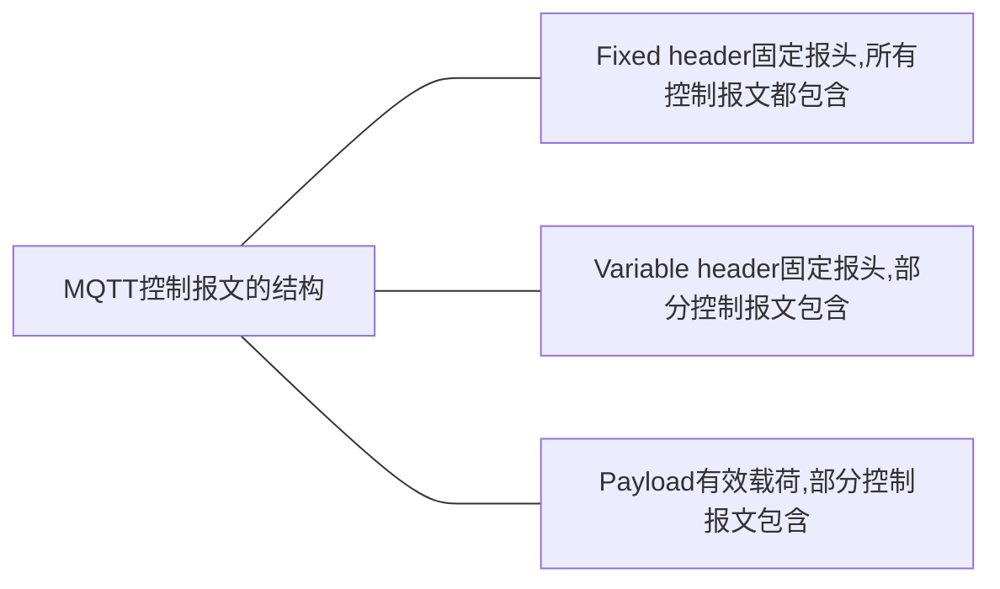

# MQTT

`MQTT`由IBM公司在90年代开发，[MQTT官网](https://mqtt.org/)

**解决问题：**

- 服务器必须要实现成千上万客户端的接入
- 单次数据的数据量小，但不能出错
- 必须能够适应高延迟、偶尔断网等通信不可靠的风险
- 能够根据数据的重要程序和特性，设置不同等级的服务质量


## MQTT介绍

**MQTT（Message Queuing Telemetry Transport，消息队列遥测传输）：**

- 是IBM推出的一种针对移动终端设备的基于`TCP/IP`的发布/订阅协议
- 可以连接大量的远程传感器和控制设备，MQTT的特点是可以保持长连接，具有一定的实时性
- 云端向设备端发送消息，设备端可以在最短的时间内接收到并作出响应
- MQTT更适合需要实时控制的场合，尤其适合执行器
- 要保持长连接，那么就要时不时地发送心跳包，这就不会省电
- 低功耗的场合并不适合MQTT
- MQTT的长连接需要建立在TCP的基础上，TCP协议的复杂性决定了对设备的要求相对UDP更高一些

**MQTT中有3个角色：**

- 发布者`Publisher`
- 订阅者`Subscriber`
- 代理`Broker`

**MQTT协议的中心是MQTT服务器或者代理（Broker）**


MQTT这种结构替代了传统的客户端/服务器模型，可以实现一下解耦：

- 空间解耦，发布者和订阅者不需要直到对方
- 时间解耦，发布者和订阅者不需要同事运行（离线消息）
- 同步解耦，发布和接收消息都是异步通讯，无需停止任何处理


### MQTT协议特性

- 使用发布/订阅消息模式，提供一对多的消息发布，解除应用程序耦合
- 有三种消息发布服务质量：`QoS0`、`QOS1`、`QOS2`

> `QoS0`：“至多一次”，消息发布完全依赖底层TCP/IP网络，会发生消息丢失或重复，这一级别可用于对采集数据要求不严格的情况
>
> `QoS1`：“至少一次”，确保消息到达，但消息可能会重复发生
>
> `QoS2`：“只有一次”，确保消息只到到达一次，这一级别可用于要求严格如涉及计费系统的情况，消息重复或丢失都不允许

- 小型传输，开销很小（固定长度的头部是2字节），协议交换最小化，以降低网络流量
- 使用`Last Will`和`Testament`特性通知有关各方客户端异常中断的机制
- 允许用户动态创建主题，零运维成本
- 把低带宽、高延迟、不稳定的网络等因素考虑在内
- 假设数据不可知，不强求传输数据的类型与格式，保持灵活性


## MQTT主题模式

- MQTT是通过主题对消息进行分类的
- 主题本质上就是一个`UTF-8`的字符串
- 主题可以通过反斜杠表示多个层级关系
- 主题并不需要创建，直接使用就可以
- 主题还可以通过通配符进行过滤
  - `+`可以过滤一个层级
  - `*`只能出现在主题最后表示过滤任意级别的层级

```shell
building-b/floor-5		# 代表B楼5层的设备
+/floor-5				# 代表任何一个楼的5层的设备
building-b/*			# 代表B楼所有设备
```


## MQTT控制报文格式

MQTT协议通过交换预定义的MQTT控制报文来通信。



### 固定报头

每个MQTT控制报头都包含一个固定报头


#### 控制报文的类型

**位置**：第1个字节，二进制位7-4

| 名字        | 值   | 报文流动方向   | 描述                               |
| ----------- | ---- | -------------- | ---------------------------------- |
| Reserved    | 0    | 禁止           | 保留                               |
| CONNECT     | 1    | 客户端到服务端 | 客户端请求连接服务端               |
| CONNACK     | 2    | 服务端到客户端 | 连接报文确认                       |
| PUBLISH     | 3    | 两个方向都允许 | 发布消息                           |
| PUBACK      | 4    | 两个方向都允许 | QoS1消息发布收到确认               |
| PUBREC      | 5    | 两个方向都允许 | 发布收到（保证交付第一步）         |
| PUBREL      | 6    | 两个方向都允许 | 发布释放（保证交付第二步）         |
| PUBCOMP     | 7    | 两个方向都允许 | QoS2消息发布完成（保证交付第三步） |
| SUBSCRIBE   | 8    | 客户端到服务器 | 客户端订阅请求                     |
| SUBACK      | 9    | 服务端到客户端 | 订阅请求报文确认                   |
| UNSUBSCRIBE | 10   | 客户端到服务端 | 客户端取消订阅请求                 |
| UNSUBACK    | 11   | 服务端到客户端 | 取消订阅报文确认                   |
| PINGREQ     | 12   | 客户端到服务端 | 心跳请求                           |
| PINGRESP    | 13   | 客户端到服务端 | 心跳响应                           |
| DISCONNECT  | 12   | 客户端到服务端 | 客户端断开连接                     |
| Reserved    | 15   | 禁止           | 保留                               |

